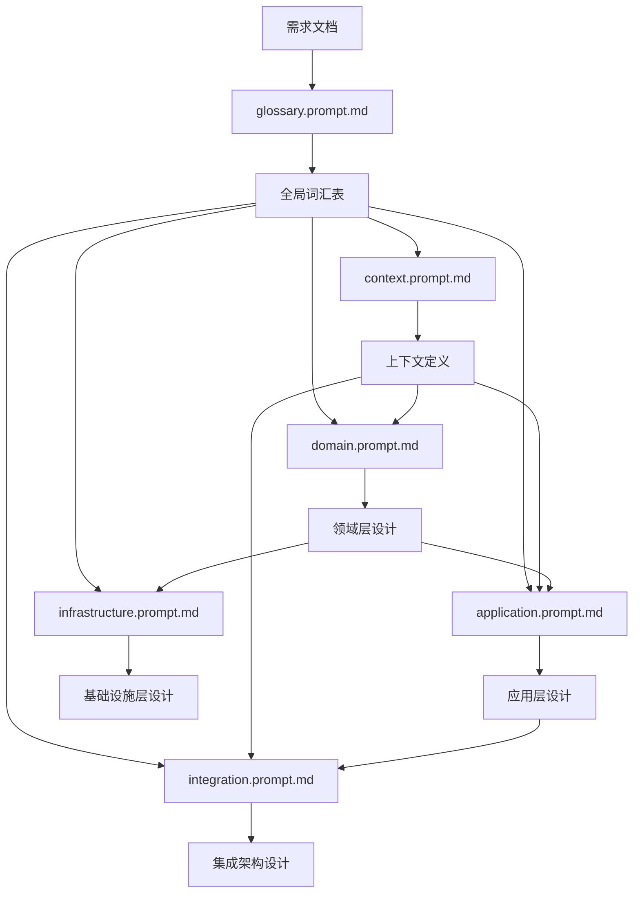

# DDD 架构设计提示词

本目录包含完整的 DDD（领域驱动设计）架构设计提示词体系，用于基于需求文档生成结构化的 DDD 设计文档。

## 🎯 核心设计理念

- **接口优先**: 专注于接口设计、结构定义和架构边界，不涉及具体实现
- **需求驱动**: 严格遵循需求设计文档，确保架构设计与业务需求完全一致
- **一致性保证**: 强化跨文档术语、接口、结构的一致性检查
- **分层设计**: 遵循 DDD 分层架构原则，清晰划分职责边界

## 📋 提示词清单

### 主控制器

- **[master-ddd.prompt.md](master-ddd.prompt.md)** - DDD 架构设计主控制器
  - 协调所有子提示词的执行顺序
  - 管理文档依赖关系和一致性验证
  - 提供完整的执行策略和质量保证机制
  - **推荐作为 DDD 设计的入口点**

### 子提示词（按执行顺序）

1. **[glossary.prompt.md](glossary.prompt.md)** - 全局词汇表生成器
   - **优先级**: 最高（必须首先执行）
   - **职责**: 建立标准化业务术语体系
   - **输出**: `/docs/Glossary.md`, `/docs/Glossary-History.md`
   - **特点**: 术语标准化、跨文档一致性保证

2. **[context.prompt.md](context.prompt.md)** - 限界上下文架构师
   - **依赖**: 全局词汇表
   - **职责**: 设计限界上下文边界和职责划分
   - **输出**: `/docs/contexts/{业务名称}/context.md`
   - **特点**: 边界清晰性、职责单一性

3. **[domain.prompt.md](domain.prompt.md)** - 领域模型架构师
   - **依赖**: 全局词汇表、上下文定义
   - **职责**: 设计聚合结构、实体接口、值对象定义
   - **输出**: `/docs/contexts/{业务名称}/domain/{聚合名称}.md`
   - **特点**: 聚合边界、接口设计、Repository 接口规范

4. **[application.prompt.md](application.prompt.md)** - 应用服务架构师
   - **依赖**: 领域层设计
   - **职责**: 设计应用服务接口和 DTO 结构
   - **输出**: `/docs/contexts/{业务名称}/application/services.md`
   - **特点**: 服务接口设计、DTO 结构、用例编排

5. **[infrastructure.prompt.md](infrastructure.prompt.md)** - 基础设施架构师
   - **依赖**: 领域层 Repository 接口定义
   - **职责**: 设计 Repository 实现规范和数据结构
   - **输出**: `/docs/contexts/{业务名称}/infrastructure/repository.md`
   - **特点**: Repository 规范、数据结构设计、对象映射

6. **[integration.prompt.md](integration.prompt.md)** - 上下文集成架构师
   - **依赖**: 多个上下文定义和应用服务
   - **职责**: 设计上下文集成架构和接口协议
   - **输出**: `/docs/contexts/{业务名称}/integration/context-mapping.md`
   - **特点**: 集成模式、接口协议、数据契约

## 🚀 使用流程

### 完整 DDD 设计流程

```bash
# 1. 准备需求文档
需求文档路径: /path/to/需求设计文档.md

# 2. 使用主控制器启动完整流程
参考 master-ddd.prompt.md 中的"完整DDD架构设计流程"指令模板

# 3. 或者手动按顺序执行各个子提示词
按照 1-6 的顺序依次执行各个子提示词
```

### 单层更新流程

```bash
# 只更新特定层的设计
使用 master-ddd.prompt.md 中的"单层设计更新"指令模板
```

### 术语变更流程

```bash
# 更新术语定义并传播到相关文档
使用 master-ddd.prompt.md 中的"术语变更更新"指令模板
```

## 📊 文档依赖关系



## ✅ 质量保证

每个子提示词都包含：

1. **需求遵循性检查**: 确保设计100%符合需求文档
2. **文档依赖验证**: 验证前置文档存在且内容完整
3. **术语一致性检查**: 确保术语使用与全局词汇表一致
4. **跨文档一致性验证**: 验证接口定义、数据结构的一致性

## 📖 示例

详细的使用示例请参考 `master-ddd.prompt.md` 中的"使用示例"章节。

## ⚠️ 注意事项

1. **强制执行顺序**: 必须按照 1-6 的顺序执行，确保依赖关系正确
2. **需求文档必需**: 所有提示词都需要提供需求文档路径
3. **前置文档验证**: 每个子提示词执行前会验证前置文档的完整性
4. **术语同步**: 术语变更后需要手动更新相关文档或使用术语变更流程

## 🔄 版本历史

- **v2.0** (2025-10-09): 重新组织提示词结构，强化一致性验证机制
- **v1.0**: 初始版本
