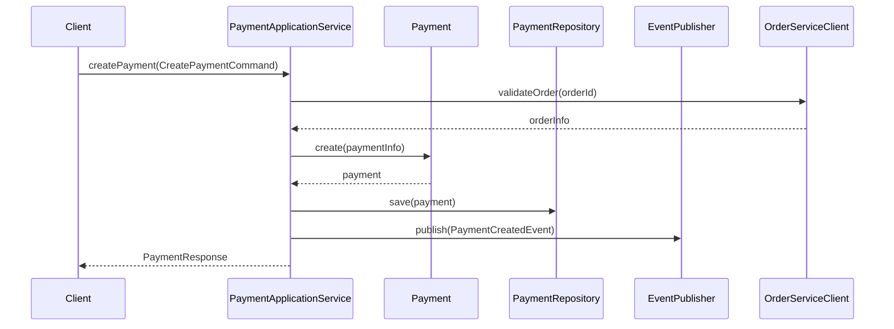

# 支付上下文应用层设计 (Payment Application Layer Design)

> **术语说明**: 本文档严格遵循全局词汇表(/docs/Glossary.md)中的标准术语定义
> **领域依赖**: 基于 `/docs/contexts/payment/domain/` 目录下的领域设计
> **版本**: v4.0
> **更新时间**: 2025年9月27日

## 应用层概述 (Application Layer Overview)

**上下文名称**: Payment Context (支付上下文)
**核心职责**: 协调支付领域业务用例执行，管理事务边界，处理外部系统集成
**主要用例**: 支付单创建、支付执行、退款处理、支付查询、合并支付
**事务策略**: 单聚合操作使用数据库事务，跨聚合协调采用最终一致性

## 应用服务设计 (Application Services Design)

### PaymentApplicationService (支付应用服务)

**服务职责**: 协调支付单生命周期管理，编排支付和退款业务流程
**依赖聚合**: Payment聚合
**事务边界**: 每个方法为一个事务单元，查询操作使用只读事务

#### 服务接口定义
```java
public interface PaymentApplicationService {
    // 命令操作 - 支付单管理
    PaymentResponse createPayment(CreatePaymentCommand command);
    PaymentResponse createCreditRepayment(CreateCreditRepaymentCommand command);
    
    // 命令操作 - 支付执行
    PaymentExecutionResponse executeSinglePayment(SinglePaymentExecutionCommand command);
    BatchPaymentResponse executeBatchPayment(BatchPaymentExecutionCommand command);
    void processPaymentCallback(PaymentCallbackCommand command);
    void processRefundCallback(RefundCallbackCommand command);
    
    // 命令操作 - 退款处理
    RefundExecutionResponse executeRefund(RefundExecutionCommand command);
    
    // 命令操作 - 状态管理
    PaymentStatusResponse updatePaymentStatus(PaymentStatusUpdateCommand command);
    PaymentResponse modifyPaymentInfo(PaymentModificationCommand command);
    
    // 查询操作 - 基础查询
    PaymentDetailResponse queryPaymentDetail(PaymentDetailQuery query);
    PaymentListResponse queryPaymentsByReseller(PaymentsByResellerQuery query);
    PaymentListResponse queryPaymentsByOrder(PaymentsByOrderQuery query);
    PaymentListResponse queryBatchablePayments(BatchablePaymentsQuery query);
    
    // 查询操作 - 高级查询
    PaymentListResponse queryPaymentsByCriteria(PaymentSearchCriteriaQuery query);
    PaymentStatisticsResponse queryPaymentStatistics(PaymentStatisticsQuery query);
    TransactionListResponse queryTransactionHistory(TransactionHistoryQuery query);
    
    // 查询操作 - 状态和进度
    PaymentStatusResponse queryPaymentStatus(PaymentStatusQuery query);
    PaymentProgressResponse queryPaymentProgress(PaymentProgressQuery query);
    RefundProgressResponse queryRefundProgress(RefundProgressQuery query);
}
```

#### 方法详细设计

##### createPayment - 创建支付单
**用例描述**: 接收订单系统或信用管理系统的支付单创建请求，创建新的支付单
**前置条件**: 关联订单存在且有效，经销商具有支付权限
**业务流程**: 
1. 验证创建请求的参数完整性和业务合规性
2. 调用OrderServiceClient验证关联订单的存在性和状态
3. 验证经销商的支付权限和企业状态
4. 创建Payment聚合实例，执行业务验证规则
5. 持久化支付单到PaymentRepository
6. 发布PaymentCreated领域事件
7. 构建并返回PaymentResponse

**异常处理**: 
- `InvalidPaymentRequestException`: 请求参数不合法或业务规则验证失败
- `OrderNotFoundException`: 关联订单不存在或状态不正确
- `ResellerUnauthorizedException`: 经销商无支付权限
- `DuplicatePaymentException`: 重复创建相同的支付单

**发布事件**: PaymentCreated - 通知订单系统和财务系统支付单已创建

##### executeSinglePayment - 执行单笔支付
**用例描述**: 执行单个支付单的支付操作，调用支付渠道完成资金转移
**前置条件**: 支付单状态允许支付，支付渠道可用，支付金额合法
**业务流程**:
1. 查询并锁定Payment聚合实例
2. 验证支付单状态和支付金额的业务合规性
3. 验证支付渠道的可用性和业务兼容性
4. 调用PaymentDomainService执行支付业务逻辑
5. 创建PaymentTransaction流水记录
6. 调用PaymentChannelAdapter执行渠道支付
7. 更新支付单状态为PAYING并持久化
8. 发布PaymentExecutionStarted领域事件

**异常处理**:
- `PaymentNotFoundException`: 支付单不存在
- `InvalidPaymentStatusException`: 支付单状态不允许支付
- `PaymentChannelUnavailableException`: 支付渠道不可用
- `InsufficientAmountException`: 支付金额不合法
- `PaymentExecutionException`: 支付执行过程中的技术异常

**发布事件**: PaymentExecutionStarted

##### processPaymentCallback - 处理支付回调
**用例描述**: 处理支付渠道的异步回调通知，更新支付单状态和金额
**前置条件**: 回调数据签名有效，关联的支付单和流水存在
**业务流程**:
1. 验证回调数据的签名和完整性
2. 根据渠道交易号查找对应的PaymentTransaction
3. 通过交易流水关联找到Payment聚合
4. 调用PaymentDomainService处理回调结果
5. 更新交易流水状态和支付单金额状态
6. 重新计算支付单的各项金额字段
7. 判断支付单是否完成并更新状态
8. 发布相应的状态变更领域事件

**异常处理**:
- `InvalidCallbackSignatureException`: 回调签名验证失败
- `CallbackDataIncompleteException`: 回调数据不完整
- `TransactionNotFoundException`: 对应的交易流水不存在
- `CallbackProcessingException`: 回调处理业务异常

**发布事件**: PaymentExecuted, PaymentStatusChanged, PaymentCompleted

### PaymentEventHandler (支付事件处理服务)

**服务职责**: 处理支付领域事件，协调跨上下文业务流程，维护系统一致性
**依赖聚合**: Payment聚合
**事务边界**: 每个事件处理为独立事务，支持最终一致性

#### 服务接口定义
```java
public interface PaymentEventHandler {
    void handlePaymentCreated(PaymentCreatedEvent event);
    void handlePaymentExecuted(PaymentExecutedEvent event);
    void handlePaymentCompleted(PaymentCompletedEvent event);
    void handleRefundExecuted(RefundExecutedEvent event);
    void handleCreditRepaymentCompleted(CreditRepaymentCompletedEvent event);
}
```

## DTO设计 (DTO Design)

### 命令DTO (Command DTOs)

#### CreatePaymentCommand
**用途**: 支付单创建请求，由订单系统或信用管理系统发起
**验证策略**: 参数完整性验证、业务规则预检查

```java
public class CreatePaymentCommand {
    // 核心业务字段
    @NotBlank(message = "关联订单号不能为空")
    @Size(max = 32, message = "订单号长度不能超过32位")
    private String orderId;
    
    @NotBlank(message = "经销商ID不能为空") 
    @Size(max = 32, message = "经销商ID长度不能超过32位")
    private String resellerId;
    
    @NotNull(message = "支付金额不能为空")
    @DecimalMin(value = "0.01", message = "支付金额必须大于0")
    @Digits(integer = 15, fraction = 6, message = "金额格式不正确")
    private BigDecimal paymentAmount;
    
    @NotNull(message = "支付类型不能为空")
    @Enumerated(EnumType.STRING)
    private PaymentType paymentType;
    
    // 可选业务字段
    @Size(max = 500, message = "业务描述长度不能超过500字符")
    private String businessDesc;
    
    @Future(message = "支付截止时间必须是未来时间")
    private LocalDateTime paymentDeadline;
    
    private PriorityLevel priorityLevel = PriorityLevel.MEDIUM;
    
    // 关联业务信息（信用还款等场景）
    @Size(max = 32, message = "关联业务ID长度不能超过32位")
    private String relatedBusinessId;
    
    @Enumerated(EnumType.STRING)
    private RelatedBusinessType relatedBusinessType;
    
    private LocalDateTime businessExpireDate;
    
    // 操作者信息
    @NotBlank(message = "创建人不能为空")
    private String createBy;
    
    @NotBlank(message = "创建人姓名不能为空")
    private String createByName;
}

**字段说明**:
| 字段名 | 类型 | 描述 | 验证规则 | 必需性 |
|--------|------|------|----------|--------|
| orderId | String(32) | 关联的订单号 | 非空，长度32位 | 必需 |
| resellerId | String(32) | 支付方经销商ID | 非空，长度32位 | 必需 |
| paymentAmount | BigDecimal | 支付金额（人民币） | >0，最多6位小数 | 必需 |
| paymentType | PaymentType | 支付类型枚举 | 有效枚举值 | 必需 |
| businessDesc | String(500) | 业务用途描述 | 最大500字符 | 可选 |
| paymentDeadline | LocalDateTime | 支付截止时间 | 未来时间 | 可选 |
| relatedBusinessId | String(32) | 关联业务记录ID | 长度32位 | 可选 |
| relatedBusinessType | RelatedBusinessType | 关联业务类型 | 有效枚举值 | 可选 |

**业务规则验证**:
- **金额合理性**: 支付金额必须在合理的业务范围内（如不超过1000万元）
- **支付类型一致性**: 信用还款类型必须提供关联业务信息
- **截止时间合理性**: 支付截止时间不能超过业务约定的最长期限

#### SinglePaymentExecutionCommand
**用途**: 单笔支付执行指令
**验证策略**: 支付渠道和金额验证

```java
public class SinglePaymentExecutionCommand {
    @NotBlank(message = "支付单号不能为空")
    @Size(max = 32, message = "支付单号长度必须为32位")
    private String paymentId;
    
    @NotNull(message = "支付金额不能为空")
    @DecimalMin(value = "0.01", message = "支付金额必须大于0")
    @Digits(integer = 15, fraction = 6, message = "金额格式不正确")
    private BigDecimal executionAmount;
    
    @NotNull(message = "支付渠道不能为空")
    @Enumerated(EnumType.STRING)
    private PaymentChannel paymentChannel;
    
    @NotBlank(message = "支付方式不能为空")
    private String paymentMethod;
    
    @Pattern(regexp = "^((2[0-4]\\d|25[0-5]|[01]?\\d\\d?)\\.){3}(2[0-4]\\d|25[0-5]|[01]?\\d\\d?)$", 
             message = "客户端IP格式不正确")
    private String clientIp;
    
    @URL(message = "回调地址格式不正确")
    private String returnUrl;
    
    private Map<String, String> extraParams = new HashMap<>();
    
    @NotBlank(message = "操作人不能为空")
    private String operatorId;
    
    @NotBlank(message = "操作人姓名不能为空")
    private String operatorName;
}

### 响应DTO (Response DTOs)

#### PaymentResponse
**用途**: 支付单创建和基础操作的响应
**数据来源**: Payment聚合的基础信息

```java
public class PaymentResponse {
    private String paymentId;
    private String orderId;
    private String resellerId;
    private BigDecimal paymentAmount;
    private String currency = "CNY";
    private PaymentStatus paymentStatus;
    private PaymentType paymentType;
    private String businessDesc;
    private LocalDateTime paymentDeadline;
    private PriorityLevel priorityLevel;
    private LocalDateTime createTime;
    private String createByName;
    
    // 关联业务信息
    private String relatedBusinessId;
    private RelatedBusinessType relatedBusinessType;
    private LocalDateTime businessExpireDate;
}
```

**字段说明**:
| 字段名 | 类型 | 描述 | 数据来源 |
|--------|------|------|----------|
| paymentId | String | 支付单号 | Payment.id |
| orderId | String | 关联订单号 | Payment.orderId |
| paymentStatus | PaymentStatus | 当前支付状态 | Payment.paymentStatus |
| paymentAmount | BigDecimal | 支付金额 | Payment.paymentAmount.amount |

#### PaymentExecutionResponse
**用途**: 支付执行操作的响应
**数据来源**: PaymentTransaction和渠道响应

```java
public class PaymentExecutionResponse {
    @NotBlank(message = "支付单号不能为空")
    private String paymentId;
    
    @NotBlank(message = "交易流水号不能为空")
    private String transactionId;
    
    @NotNull(message = "支付状态不能为空")
    private PaymentStatus paymentStatus;
    
    @NotNull(message = "交易状态不能为空")
    private TransactionStatus transactionStatus;
    
    // 渠道响应信息
    private String channelResponse;
    private String channelTransactionNumber;
    private String redirectUrl;
    private String qrCodeContent;
    
    // 预估信息
    private Integer estimatedConfirmTimeSeconds;
    private LocalDateTime estimatedCompleteTime;
    
    // 执行结果
    private boolean executeSuccess;
    private String executeMessage;
    private LocalDateTime executeTime;
}
```

## 用例编排设计 (Use Case Orchestration)

### 创建支付单 用例流程

**参与者**: 订单系统、信用管理系统、支付应用服务
**主流程**:


**异常流程**:
- **业务异常路径**: 订单不存在时返回OrderNotFoundException
- **技术异常路径**: 数据库异常时回滚事务并返回系统错误

### 执行支付 跨聚合协调流程

**协调策略**: 通过领域事件协调支付状态与外部系统同步
**一致性保证**: 本地事务保证聚合一致性，事件机制保证最终一致性
**补偿机制**: 支付失败时通过补偿事务恢复状态

## 依赖注入配置 (Dependency Injection)

### 应用服务依赖
```java
@Service
public class PaymentApplicationServiceImpl implements PaymentApplicationService {
    
    private final PaymentRepository paymentRepository;
    private final DomainEventPublisher eventPublisher;
    private final OrderServiceClient orderServiceClient;
    private final PaymentDomainService paymentDomainService;
    private final PaymentChannelAdapter paymentChannelAdapter;
    
    // 构造函数注入
    public PaymentApplicationServiceImpl(
        PaymentRepository paymentRepository,
        DomainEventPublisher eventPublisher,
        OrderServiceClient orderServiceClient,
        PaymentDomainService paymentDomainService,
        PaymentChannelAdapter paymentChannelAdapter
    ) {
        this.paymentRepository = paymentRepository;
        this.eventPublisher = eventPublisher;
        this.orderServiceClient = orderServiceClient;
        this.paymentDomainService = paymentDomainService;
        this.paymentChannelAdapter = paymentChannelAdapter;
    }
}
```

### 外部依赖接口
| 依赖名称 | 接口类型 | 用途 | 实现位置 |
|----------|----------|------|----------|
| PaymentRepository | Repository Interface | 支付聚合持久化 | 基础设施层 |
| OrderServiceClient | Anti-Corruption Layer | 订单系统集成 | 基础设施层 |
| PaymentChannelAdapter | Adapter Interface | 支付渠道集成 | 基础设施层 |
| DomainEventPublisher | Publisher Interface | 领域事件发布 | 基础设施层 |

## 事务管理 (Transaction Management)

### 事务边界策略
- **单聚合事务**: Payment聚合的CRUD操作在单一数据库事务内完成
- **跨聚合协调**: 通过领域事件和最终一致性保证多个上下文间的数据一致性
- **外部集成事务**: 与支付渠道交互采用补偿模式处理失败情况

### 事务配置
```java
@Transactional(rollbackFor = Exception.class)
public PaymentResponse createPayment(CreatePaymentCommand command) {
    try {
        // 1. 验证和转换输入
        // 2. 创建Payment聚合
        // 3. 持久化聚合状态
        // 4. 发布领域事件（事务提交后异步）
    } catch (BusinessException e) {
        // 业务异常处理
        throw new ApplicationException(e.getMessage(), e);
    }
}
```

## 异常处理策略 (Exception Handling)

### 异常分类和处理
| 异常类型 | 触发条件 | 处理策略 | 返回码 |
|----------|----------|----------|--------|
| InvalidPaymentRequestException | 创建请求参数不合法 | 返回参数验证错误信息 | 400 |
| PaymentNotFoundException | 支付单不存在 | 返回资源不存在错误 | 404 |
| PaymentStatusConflictException | 支付状态不允许操作 | 返回状态冲突错误 | 409 |
| PaymentChannelUnavailableException | 支付渠道不可用 | 返回服务不可用错误 | 503 |

### 异常处理实现
```java
@ExceptionHandler(PaymentNotFoundException.class)
public ResponseEntity<ErrorResponse> handlePaymentNotFound(PaymentNotFoundException e) {
    return ResponseEntity
        .status(HttpStatus.NOT_FOUND)
        .body(new ErrorResponse("PAYMENT_NOT_FOUND", e.getMessage()));
}
```

## 性能考虑 (Performance Considerations)

### 查询优化
- **聚合查询**: 通过Repository接口的预加载方法避免N+1查询问题
- **只读查询**: 支付单列表查询使用只读事务，减少锁竞争
- **缓存策略**: 对频繁查询的支付渠道配置信息进行缓存

### 批量操作优化
- **批量处理**: 合并支付使用批量数据库操作，减少数据库往返次数
- **分页处理**: 大数据量查询支持分页，避免内存溢出
- **异步处理**: 支付回调处理采用异步机制，提高系统吞吐量

---

## 设计原则检查

### 应用层职责
- [x] 应用服务只做编排,不包含业务逻辑
- [x] DTO只做数据传输,不包含业务行为  
- [x] 事务边界清晰合理
- [x] 异常处理覆盖全面

### 依赖管理
- [x] 应用层依赖领域层接口
- [x] 外部依赖通过接口抽象
- [x] 循环依赖已避免

### 性能设计
- [x] 查询策略合理高效
- [x] 批量操作已优化
- [x] 缓存策略恰当

---

**文档状态**: ✅ 已完成  
**版本**: v3.0  
**最后更新**: 2024年12月19日  
**术语基准**: 全局词汇表 v3.0, 支付上下文设计 v3.0  
**审核状态**: 待技术评审

## DTO设计 (DTO Design)

### 命令DTO (Command DTOs)

#### CreatePaymentCommand
**用途**: 支付单创建请求，由订单系统或信用管理系统发起
**验证策略**: 参数完整性验证、业务规则预检查

```java
public class CreatePaymentCommand {
    // 核心业务字段
    @NotBlank(message = "关联订单号不能为空")
    @Size(max = 32, message = "订单号长度不能超过32位")
    private String orderId;
    
    @NotBlank(message = "经销商ID不能为空") 
    @Size(max = 32, message = "经销商ID长度不能超过32位")
    private String resellerId;
    
    @NotNull(message = "支付金额不能为空")
    @DecimalMin(value = "0.01", message = "支付金额必须大于0")
    @Digits(integer = 15, fraction = 6, message = "金额格式不正确")
    private BigDecimal paymentAmount;
    
    @NotNull(message = "支付类型不能为空")
    @Enumerated(EnumType.STRING)
    private PaymentType paymentType;
    
    // 可选业务字段
    @Size(max = 500, message = "业务描述长度不能超过500字符")
    private String businessDesc;
    
    @Future(message = "支付截止时间必须是未来时间")
    private LocalDateTime paymentDeadline;
    
    private PriorityLevel priorityLevel = PriorityLevel.MEDIUM;
    
    // 关联业务信息（信用还款等场景）
    @Size(max = 32, message = "关联业务ID长度不能超过32位")
    private String relatedBusinessId;
    
    @Enumerated(EnumType.STRING)
    private RelatedBusinessType relatedBusinessType;
    
    private LocalDateTime businessExpireDate;
    
    // 操作者信息
    @NotBlank(message = "创建人不能为空")
    private String createBy;
    
    @NotBlank(message = "创建人姓名不能为空")
    private String createByName;
}
```

**字段说明**:
| 字段名 | 类型 | 描述 | 验证规则 | 必需性 |
|--------|------|------|----------|--------|
| orderId | String(32) | 关联的订单号 | 非空，长度32位 | 必需 |
| resellerId | String(32) | 支付方经销商ID | 非空，长度32位 | 必需 |
| paymentAmount | BigDecimal | 支付金额（人民币） | >0，最多6位小数 | 必需 |
| paymentType | PaymentType | 支付类型枚举 | 有效枚举值 | 必需 |
| businessDesc | String(500) | 业务用途描述 | 最大500字符 | 可选 |
| paymentDeadline | LocalDateTime | 支付截止时间 | 未来时间 | 可选 |
| relatedBusinessId | String(32) | 关联业务记录ID | 长度32位 | 可选 |
| relatedBusinessType | RelatedBusinessType | 关联业务类型 | 有效枚举值 | 可选 |

**业务规则验证**:
- **金额合理性**: 支付金额必须在合理的业务范围内（如不超过1000万元）
- **支付类型一致性**: 信用还款类型必须提供关联业务信息
- **截止时间合理性**: 支付截止时间不能超过业务约定的最长期限

#### CreateCreditRepaymentCommand
**用途**: 信用还款支付单创建，专门用于信用管理系统发起的还款请求
**验证策略**: 信用业务特殊规则验证

```java
public class CreateCreditRepaymentCommand {
    @NotBlank(message = "信用记录ID不能为空")
    @Size(max = 32, message = "信用记录ID长度不能超过32位")
    private String creditRecordId;
    
    @NotBlank(message = "经销商ID不能为空")
    @Size(max = 32, message = "经销商ID长度不能超过32位") 
    private String resellerId;
    
    @NotNull(message = "还款金额不能为空")
    @DecimalMin(value = "0.01", message = "还款金额必须大于0")
    @Digits(integer = 15, fraction = 6, message = "金额格式不正确")
    private BigDecimal repaymentAmount;
    
    @NotNull(message = "还款到期日不能为空")
    @Future(message = "还款到期日必须是未来时间")
    private LocalDateTime repaymentDueDate;
    
    @Size(max = 500, message = "还款说明长度不能超过500字符")
    private String repaymentDesc;
    
    @NotBlank(message = "创建人不能为空")
    private String createBy;
    
    @NotBlank(message = "创建人姓名不能为空")
    private String createByName;
}
```

#### SinglePaymentExecutionCommand
**用途**: 单笔支付执行指令
**验证策略**: 支付渠道和金额验证

```java
public class SinglePaymentExecutionCommand {
    @NotBlank(message = "支付单号不能为空")
    @Size(max = 32, message = "支付单号长度必须为32位")
    private String paymentId;
    
    @NotNull(message = "支付金额不能为空")
    @DecimalMin(value = "0.01", message = "支付金额必须大于0")
    @Digits(integer = 15, fraction = 6, message = "金额格式不正确")
    private BigDecimal executionAmount;
    
    @NotNull(message = "支付渠道不能为空")
    @Enumerated(EnumType.STRING)
    private PaymentChannel paymentChannel;
    
    @NotBlank(message = "支付方式不能为空")
    private String paymentMethod;
    
    @Pattern(regexp = "^((2[0-4]\\d|25[0-5]|[01]?\\d\\d?)\\.){3}(2[0-4]\\d|25[0-5]|[01]?\\d\\d?)$", 
             message = "客户端IP格式不正确")
    private String clientIp;
    
    @URL(message = "回调地址格式不正确")
    private String returnUrl;
    
    private Map<String, String> extraParams = new HashMap<>();
    
    @NotBlank(message = "操作人不能为空")
    private String operatorId;
    
    @NotBlank(message = "操作人姓名不能为空")
    private String operatorName;
}
```

#### BatchPaymentExecutionCommand
**用途**: 合并支付执行指令
**验证策略**: 批量支付业务规则验证

```java
public class BatchPaymentExecutionCommand {
    @NotEmpty(message = "支付单号列表不能为空")
    @Size(min = 2, max = 50, message = "合并支付数量必须在2-50之间")
    private List<@NotBlank @Size(max = 32) String> paymentIds;
    
    @NotNull(message = "支付渠道不能为空")
    @Enumerated(EnumType.STRING)
    private PaymentChannel paymentChannel;
    
    @NotBlank(message = "支付方式不能为空")
    private String paymentMethod;
    
    @Pattern(regexp = "^((2[0-4]\\d|25[0-5]|[01]?\\d\\d?)\\.){3}(2[0-4]\\d|25[0-5]|[01]?\\d\\d?)$", 
             message = "客户端IP格式不正确")
    private String clientIp;
    
    @URL(message = "回调地址格式不正确")
    private String returnUrl;
    
    @NotBlank(message = "操作人不能为空")
    private String operatorId;
    
    @NotBlank(message = "操作人姓名不能为空")
    private String operatorName;
}
```

#### RefundExecutionCommand
**用途**: 退款执行指令，由订单系统审批后发起
**验证策略**: 退款业务规则和金额验证

```java
public class RefundExecutionCommand {
    @NotBlank(message = "支付单号不能为空")
    @Size(max = 32, message = "支付单号长度必须为32位")
    private String paymentId;
    
    @NotNull(message = "退款金额不能为空")
    @DecimalMin(value = "0.01", message = "退款金额必须大于0")
    @Digits(integer = 15, fraction = 6, message = "金额格式不正确")
    private BigDecimal refundAmount;
    
    @NotBlank(message = "退款原因不能为空")
    @Size(max = 200, message = "退款原因长度不能超过200字符")
    private String refundReason;
    
    @NotBlank(message = "业务退款单号不能为空")
    @Size(max = 32, message = "业务退款单号长度必须为32位")
    private String businessOrderId;
    
    @Size(max = 32, message = "原交易流水号长度必须为32位")
    private String originalTransactionId;
    
    @NotBlank(message = "操作人不能为空")
    private String operatorId;
    
    @NotBlank(message = "操作人姓名不能为空")
    private String operatorName;
}
```

### 查询DTO (Query DTOs)

#### PaymentDetailQuery
**查询条件**: 支付单详情查询
**分页支持**: 不支持（单条记录查询）

```java
public class PaymentDetailQuery {
    @NotBlank(message = "支付单号不能为空")
    @Size(max = 32, message = "支付单号长度必须为32位")
    private String paymentId;
    
    @NotBlank(message = "查询人不能为空")
    private String queryUserId;
    
    // 是否包含交易流水详情
    private boolean includeTransactions = true;
    
    // 是否包含关联业务信息
    private boolean includeRelatedBusiness = false;
}
```

#### PaymentsByResellerQuery
**查询条件**: 按经销商查询支付单列表
**分页支持**: 支持分页和排序

```java
public class PaymentsByResellerQuery {
    @NotBlank(message = "经销商ID不能为空")
    @Size(max = 32, message = "经销商ID长度必须为32位")
    private String resellerId;
    
    // 可选筛选条件
    @Enumerated(EnumType.STRING)
    private PaymentStatus paymentStatus;
    
    @Enumerated(EnumType.STRING)
    private PaymentType paymentType;
    
    private LocalDate createDateFrom;
    private LocalDate createDateTo;
    
    private BigDecimal minAmount;
    private BigDecimal maxAmount;
    
    // 分页参数
    @Min(value = 0, message = "页码必须大于等于0")
    private int page = 0;
    
    @Min(value = 1, message = "页面大小必须大于0")
    @Max(value = 100, message = "页面大小不能超过100")
    private int size = 20;
    
    // 排序参数
    private String sortBy = "createTime";
    private String sortDirection = "DESC";
}
```

#### BatchablePaymentsQuery
**查询条件**: 查询可合并支付的支付单
**分页支持**: 支持，用于前端分页选择

```java
public class BatchablePaymentsQuery {
    @NotBlank(message = "经销商ID不能为空")
    @Size(max = 32, message = "经销商ID长度必须为32位")
    private String resellerId;
    
    @NotNull(message = "支付渠道不能为空")
    @Enumerated(EnumType.STRING)
    private PaymentChannel preferredChannel;
    
    // 金额范围限制
    private BigDecimal minAmount;
    private BigDecimal maxAmount;
    
    // 支付类型筛选
    private Set<PaymentType> paymentTypes;
    
    // 分页参数
    @Min(value = 0, message = "页码必须大于等于0")
    private int page = 0;
    
    @Min(value = 1, message = "页面大小必须大于0")
    @Max(value = 50, message = "页面大小不能超过50")
    private int size = 20;
}
```

### 响应DTO (Response DTOs)

#### PaymentTransactionDto
**用途**: 支付和退款交易流水信息的传输
**数据来源**: PaymentTransaction实体

```java
public class PaymentTransactionDto {
    private String transactionId;
    private String paymentId;
    private TransactionType transactionType;     // PAYMENT, REFUND
    private TransactionStatus transactionStatus; // SUCCESS, FAILED, PENDING
    private BigDecimal amount;
    private String currency = "CNY";
    
    // 渠道信息
    private String channelCode;
    private String channelTransactionId;
    private String channelResponse;
    
    // 业务信息
    private String businessOrderId;  // 关联的业务单号（退款时使用）
    private String originalTransactionId;  // 原支付交易ID（退款时使用）
    private Map<String, String> businessMetadata;
    
    // 时间信息
    private LocalDateTime createTime;
    private LocalDateTime completeTime;
    private LocalDateTime notifyTime;  // 通知/回调时间
    
    // 操作信息
    private String operatorId;
    private String operatorName;
    private String remark;
}
```

**字段说明**:
| 字段名 | 类型 | 描述 | 数据来源 |
|--------|------|------|----------|
| transactionId | String | 交易流水号 | Transaction.id |
| transactionType | TransactionType | 交易类型 | Transaction.type |
| transactionStatus | TransactionStatus | 交易状态 | Transaction.status |
| amount | BigDecimal | 交易金额 | Transaction.amount.amount |
| channelTransactionId | String | 渠道交易号 | Transaction.channelInfo.transactionId |
| businessOrderId | String | 业务单号 | Transaction.businessInfo.orderId |

#### PaymentResponse
**用途**: 支付单创建和基础操作的响应
**数据来源**: Payment聚合的基础信息

```java
public class PaymentResponse {
    private String paymentId;
    private String orderId;
    private String resellerId;
    private BigDecimal paymentAmount;
    private String currency = "CNY";
    private PaymentStatus paymentStatus;
    private PaymentType paymentType;
    private String businessDesc;
    private LocalDateTime paymentDeadline;
    private PriorityLevel priorityLevel;
    private LocalDateTime createTime;
    private String createByName;
    
    // 关联业务信息
    private String relatedBusinessId;
    private RelatedBusinessType relatedBusinessType;
    private LocalDateTime businessExpireDate;
}
```

**字段说明**:
| 字段名 | 类型 | 描述 | 数据来源 |
|--------|------|------|----------|
| paymentId | String | 支付单号 | Payment.id |
| orderId | String | 关联订单号 | Payment.orderId |
| paymentStatus | PaymentStatus | 当前支付状态 | Payment.paymentStatus |
| paymentAmount | BigDecimal | 支付金额 | Payment.paymentAmount.amount |

#### PaymentDetailResponse
**用途**: 支付单详情查询响应，包含完整信息
**数据来源**: Payment聚合及其内部实体

```java
public class PaymentDetailResponse {
    // 基础信息
    @NotBlank(message = "支付单号不能为空")
    @Size(max = 32, message = "支付单号长度必须为32位")
    private String paymentId;
    
    @NotBlank(message = "订单号不能为空")
    @Size(max = 32, message = "订单号长度必须为32位")
    private String orderId;
    
    @NotBlank(message = "经销商ID不能为空")
    @Size(max = 32, message = "经销商ID长度必须为32位")
    private String resellerId;
    
    // 金额信息
    @NotNull(message = "支付金额不能为空")
    @DecimalMin(value = "0.01", message = "支付金额必须大于0")
    @Digits(integer = 15, fraction = 6, message = "金额格式不正确")
    private BigDecimal paymentAmount;
    
    @NotNull(message = "已支付金额不能为空")
    @DecimalMin(value = "0.00", message = "已支付金额必须大于等于0")
    @Digits(integer = 15, fraction = 6, message = "金额格式不正确")
    private BigDecimal paidAmount;
    
    @NotNull(message = "已退款金额不能为空")
    @DecimalMin(value = "0.00", message = "已退款金额必须大于等于0")
    @Digits(integer = 15, fraction = 6, message = "金额格式不正确")
    private BigDecimal refundedAmount;
    
    @NotNull(message = "实际金额不能为空")
    @DecimalMin(value = "0.00", message = "实际金额必须大于等于0")
    @Digits(integer = 15, fraction = 6, message = "金额格式不正确")
    private BigDecimal actualAmount;
    
    @NotNull(message = "待处理金额不能为空")
    @DecimalMin(value = "0.00", message = "待处理金额必须大于等于0")
    @Digits(integer = 15, fraction = 6, message = "金额格式不正确")
    private BigDecimal pendingAmount;
    
    @NotBlank(message = "货币类型不能为空")
    @Pattern(regexp = "^[A-Z]{3}$", message = "货币类型必须是3位大写字母")
    private String currency;
    
    // 状态信息
    private PaymentStatus paymentStatus;
    private RefundStatus refundStatus;
    private PaymentType paymentType;
    
    // 业务信息
    private String businessDesc;
    private LocalDateTime paymentDeadline;
    private PriorityLevel priorityLevel;
    
    // 关联业务信息
    private String relatedBusinessId;
    private RelatedBusinessType relatedBusinessType;
    private LocalDateTime businessExpireDate;
    private Map<String, String> businessTags;
    
    // 交易流水
    private List<PaymentTransactionDto> paymentTransactions;
    private List<PaymentTransactionDto> refundTransactions;
    
    // 系统信息
    private LocalDateTime createTime;
    private LocalDateTime updateTime;
    private String createByName;
    private String updateByName;
}
```

#### PaymentExecutionResponse
**用途**: 支付执行操作的响应
**数据来源**: PaymentTransaction和渠道响应

```java
public class PaymentExecutionResponse {
    @NotBlank(message = "支付单号不能为空")
    @Size(max = 32, message = "支付单号长度必须为32位")
    private String paymentId;
    
    @NotBlank(message = "交易流水号不能为空")
    @Size(max = 32, message = "交易流水号长度必须为32位")
    private String transactionId;
    
    @NotNull(message = "支付状态不能为空")
    @Enumerated(EnumType.STRING)
    private PaymentStatus paymentStatus;
    
    @NotNull(message = "交易状态不能为空")
    @Enumerated(EnumType.STRING)
    private TransactionStatus transactionStatus;
    
    // 渠道响应信息
    @Size(max = 2000, message = "渠道响应长度不能超过2000字符")
    private String channelResponse;
    
    @Size(max = 64, message = "渠道交易号长度不能超过64字符")
    private String channelTransactionNumber;
    
    @URL(message = "跳转地址格式不正确")
    private String redirectUrl;
    
    @Size(max = 512, message = "二维码内容长度不能超过512字符")
    private String qrCodeContent;
    
    // 预估信息
    private Integer estimatedConfirmTimeSeconds;
    private LocalDateTime estimatedCompleteTime;
    
    // 执行结果
    private boolean executeSuccess;
    private String executeMessage;
    private LocalDateTime executeTime;
}
```

#### BatchPaymentResponse
**用途**: 合并支付执行的响应
**数据来源**: 多个PaymentTransaction和批量执行结果

```java
public class BatchPaymentResponse {
    private String batchId;
    private List<String> paymentIds;
    private BigDecimal totalAmount;
    private PaymentChannel paymentChannel;
    
    // 批量执行结果
    private boolean overallSuccess;
    private List<SinglePaymentExecutionResult> individualResults;
    
    // 渠道信息
    private String channelTransactionNumber;
    private String redirectUrl;
    private Integer estimatedConfirmTimeSeconds;
    
    // 执行统计
    private int successCount;
    private int failureCount;
    private LocalDateTime batchExecuteTime;
    
    public static class SinglePaymentExecutionResult {
        private String paymentId;
        private String transactionId;
        private boolean success;
        private String message;
        private BigDecimal allocatedAmount;
    }
}
```

#### executePayment (执行支付)
```text
方法签名: PaymentExecutionResponse executePayment(PaymentExecutionRequest request)
业务描述: 执行单个支付单的支付操作，调用支付渠道
输入参数: PaymentExecutionRequest
输出结果: PaymentExecutionResponse
事务边界: 方法级事务
异常处理:
  - PaymentNotFoundException -> 404 Not Found
  - InvalidPaymentStatusException -> 400 Bad Request
  - PaymentChannelUnavailableException -> 503 Service Unavailable
  - InsufficientPaymentAmountException -> 400 Bad Request
```

#### executeBatchPayment (执行合并支付)
```text
方法签名: BatchPaymentResponse executeBatchPayment(BatchPaymentRequest request)
业务描述: 执行多个支付单的合并支付操作
输入参数: BatchPaymentRequest
输出结果: BatchPaymentResponse
事务边界: 方法级事务
异常处理:
  - PaymentsNotFoundException -> 404 Not Found
  - IncompatiblePaymentsException -> 400 Bad Request
  - PaymentChannelUnavailableException -> 503 Service Unavailable
```

#### processPaymentCallback (处理支付回调)
```text
方法签名: void processPaymentCallback(PaymentCallbackRequest request)
业务描述: 处理支付渠道的异步回调通知
输入参数: PaymentCallbackRequest
输出结果: void
事务边界: 方法级事务
异常处理:
  - InvalidSignatureException -> 401 Unauthorized
  - PaymentNotFoundException -> 404 Not Found
  - InvalidCallbackDataException -> 400 Bad Request
```

#### executeRefund (执行退款)
```text
方法签名: RefundExecutionResponse executeRefund(RefundExecutionRequest request)
业务描述: 执行退款操作，更新支付单状态
输入参数: RefundExecutionRequest
输出结果: RefundExecutionResponse
事务边界: 方法级事务
异常处理:
  - PaymentNotFoundException -> 404 Not Found
  - InvalidRefundAmountException -> 400 Bad Request
  - RefundNotAllowedException -> 403 Forbidden
```

#### queryPayment (查询支付)
```text
方法签名: PaymentDetailResponse queryPayment(PaymentQueryRequest request)
业务描述: 查询支付单详细信息和状态
输入参数: PaymentQueryRequest
输出结果: PaymentDetailResponse
事务边界: 只读事务
异常处理:
  - PaymentNotFoundException -> 404 Not Found
  - UnauthorizedAccessException -> 403 Forbidden
```

#### PaymentListResponse
**用途**: 支付单列表查询响应，包含分页信息
**数据来源**: Payment聚合的列表数据

```java
public class PaymentListResponse {
    // 分页信息
    @NotNull(message = "分页信息不能为空")
    private PageInfo pageInfo;
    
    // 支付单列表
    @NotNull(message = "支付单列表不能为空")
    private List<PaymentSummaryResponse> payments;
    
    // 统计信息
    @NotNull(message = "总金额不能为空")
    @DecimalMin(value = "0.00", message = "总金额必须大于等于0")
    private BigDecimal totalAmount;
    
    private int totalCount;
    
    // 内部分页类
    public static class PageInfo {
        @Min(value = 0, message = "当前页码不能小于0")
        private int currentPage;
        
        @Min(value = 1, message = "每页大小必须大于0")
        private int pageSize;
        
        private int totalPages;
        
        @Min(value = 0, message = "总记录数不能小于0")
        private long totalRecords;
        
        private boolean hasNext;
        private boolean hasPrevious;
    }
}
```

#### PaymentSummaryResponse
**用途**: 支付单列表项的简要信息
**数据来源**: Payment聚合的基础信息

```java
public class PaymentSummaryResponse {
    @NotBlank(message = "支付单号不能为空")
    @Size(max = 32, message = "支付单号长度必须为32位")
    private String paymentId;
    
    @NotBlank(message = "订单号不能为空")
    @Size(max = 32, message = "订单号长度必须为32位")
    private String orderId;
    
    @NotBlank(message = "经销商ID不能为空")
    @Size(max = 32, message = "经销商ID长度必须为32位")
    private String resellerId;
    
    @NotNull(message = "支付金额不能为空")
    @DecimalMin(value = "0.01", message = "支付金额必须大于0")
    private BigDecimal paymentAmount;
    
    @NotNull(message = "已支付金额不能为空")
    @DecimalMin(value = "0.00", message = "已支付金额必须大于等于0")
    private BigDecimal paidAmount;
    
    @NotBlank(message = "货币类型不能为空")
    @Pattern(regexp = "^[A-Z]{3}$", message = "货币类型必须是3位大写字母")
    private String currency = "CNY";
    
    @NotNull(message = "支付状态不能为空")
    @Enumerated(EnumType.STRING)
    private PaymentStatus paymentStatus;
    
    @NotNull(message = "支付类型不能为空")
    @Enumerated(EnumType.STRING)
    private PaymentType paymentType;
    
    @NotNull(message = "创建时间不能为空")
    private LocalDateTime createTime;
    
    @NotBlank(message = "创建人不能为空")
    private String createByName;
    
    private String businessDesc;
    private LocalDateTime paymentDeadline;
    private String relatedBusinessId;
    private RelatedBusinessType relatedBusinessType;
    
    // 是否可合并支付
    private boolean batchable;
    
    // 是否有退款
    private boolean hasRefund;
    
    // 最近交易时间
    private LocalDateTime lastTransactionTime;
}
```

### 依赖注入(Dependencies)
```text
- PaymentRepository: 支付仓储
- PaymentExecutionService: 支付执行领域服务
- PaymentValidationService: 支付验证领域服务
- ChannelSelectionService: 渠道选择领域服务
- DomainEventPublisher: 领域事件发布器
- PaymentChannelAdapter: 支付渠道适配器(用于第三方渠道集成)
- OrderServiceClient: 订单服务客户端
```

### 事务边界(Transaction Boundary)
- 每个应用服务方法为一个事务单元
- 查询操作使用只读事务
- 跨聚合操作通过领域事件实现最终一致性
- 外部服务调用不在同一事务内

## DTO设计(DTO Design)

### 输入DTO (Input DTOs)

#### CreatePaymentRequest
```text
DTO名称(DTO Name): CreatePaymentRequest
使用场景(Usage Scenario): 创建支付单输入
属性列表(Attributes):
  - relatedOrderId: String (关联订单号)
  - companyUserId: String (企业用户ID)
  - paymentAmount: BigDecimal (支付金额)
  - currency: String (货币类型)
  - paymentType: String (支付类型: ADVANCE_PAYMENT, FINAL_PAYMENT, OTHER_PAYMENT)
  - paymentDeadline: LocalDateTime (支付截止时间, 可选)
  - businessDescription: String (业务描述, 可选)

验证规则(Validation Rules):
  - relatedOrderId: 必填，长度32位
  - companyUserId: 必填，长度32位
  - paymentAmount: 必填，大于0，最多2位小数
  - currency: 必填，符合ISO 4217标准
  - paymentType: 必填，枚举值有效
  - paymentDeadline: 可选，必须是未来时间
  - businessDescription: 可选，最大长度500字符

转换规则(Conversion Rules):
  - paymentAmount + currency -> Money值对象
  - paymentType -> PaymentType枚举
  - relatedOrderId -> OrderId值对象
  - companyUserId -> CompanyUserId值对象
```

#### PaymentExecutionRequest
```text
DTO名称(DTO Name): PaymentExecutionRequest
使用场景(Usage Scenario): 执行支付输入
属性列表(Attributes):
  - paymentId: String (支付号)
  - paymentAmount: BigDecimal (支付金额)
  - channelCode: String (支付渠道代码)
  - paymentMethod: String (支付方式)
  - clientIp: String (客户端IP)
  - returnUrl: String (回调地址, 可选)
  - extraParams: Map<String, String> (额外参数, 可选)

验证规则(Validation Rules):
  - paymentId: 必填，长度32位
  - paymentAmount: 必填，大于0，最多2位小数
  - channelCode: 必填，非空
  - paymentMethod: 必填，枚举值有效
  - clientIp: 必填，有效IP格式
  - returnUrl: 可选，有效URL格式

转换规则(Conversion Rules):
  - paymentId -> PaymentId值对象
  - paymentAmount -> Money值对象
  - channelCode -> PaymentChannel值对象
  - paymentMethod -> PaymentMethod枚举
```

#### BatchPaymentRequest
```text
DTO名称(DTO Name): BatchPaymentRequest
使用场景(Usage Scenario): 合并支付输入
属性列表(Attributes):
  - paymentIds: List<String> (支付号列表)
  - channelCode: String (支付渠道代码)
  - paymentMethod: String (支付方式)
  - clientIp: String (客户端IP)
  - returnUrl: String (回调地址, 可选)

验证规则(Validation Rules):
  - paymentIds: 必填，非空列表，每个元素长度32位
  - channelCode: 必填，非空
  - paymentMethod: 必填，枚举值有效
  - clientIp: 必填，有效IP格式
  - returnUrl: 可选，有效URL格式

转换规则(Conversion Rules):
  - paymentIds -> List<PaymentId>值对象
  - channelCode -> PaymentChannel值对象
  - paymentMethod -> PaymentMethod枚举
```

#### RefundExecutionRequest
```text
DTO名称(DTO Name): RefundExecutionRequest
使用场景(Usage Scenario): 退款执行输入
属性列表(Attributes):
  - paymentId: String (支付号)
  - refundAmount: BigDecimal (退款金额)
  - refundReason: String (退款原因)
  - orderRefundId: String (订单退款单号)
  - originalTransactionId: String (原支付流水号, 可选)

验证规则(Validation Rules):
  - paymentId: 必填，长度32位
  - refundAmount: 必填，大于0，最多2位小数
  - refundReason: 必填，最大长度200字符
  - orderRefundId: 必填，长度32位
  - originalTransactionId: 可选，长度32位

转换规则(Conversion Rules):
  - paymentId -> PaymentId值对象
  - refundAmount -> Money值对象
  - originalTransactionId -> PaymentTransactionId值对象
```

### 输出DTO (Output DTOs)

#### PaymentResponse
```text
DTO名称(DTO Name): PaymentResponse
使用场景(Usage Scenario): 支付创建输出
属性列表(Attributes):
  - paymentId: String (支付号)
  - relatedOrderId: String (关联订单号)
  - paymentAmount: BigDecimal (支付金额)
  - currency: String (货币类型)
  - paymentStatus: String (支付状态)
  - paymentType: String (支付类型)
  - createdAt: LocalDateTime (创建时间)

转换规则(Conversion Rules):
  - Payment实体 -> PaymentResponse DTO
  - Money值对象 -> paymentAmount + currency字段
  - PaymentStatus枚举 -> paymentStatus字符串
  - PaymentType枚举 -> paymentType字符串
```

#### PaymentExecutionResponse
```text
DTO名称(DTO Name): PaymentExecutionResponse
使用场景(Usage Scenario): 支付执行输出
属性列表(Attributes):
  - paymentId: String (支付号)
  - transactionId: String (交易流水号)
  - paymentStatus: String (支付状态)
  - channelResponse: String (渠道响应)
  - redirectUrl: String (跳转地址, 可选)
  - qrCode: String (二维码内容, 可选)
  - estimatedTime: Integer (预计确认时间, 秒)

转换规则(Conversion Rules):
  - PaymentTransaction实体 -> PaymentExecutionResponse DTO
  - 渠道适配器响应 -> channelResponse字段
```

#### PaymentDetailResponse
```text
DTO名称(DTO Name): PaymentDetailResponse
使用场景(Usage Scenario): 支付详情查询输出
属性列表(Attributes):
  - paymentId: String (支付号)
  - relatedOrderId: String (关联订单号)
  - companyUserId: String (企业用户ID)
  - paymentAmount: BigDecimal (支付金额)
  - paidAmount: BigDecimal (已支付金额)
  - refundedAmount: BigDecimal (已退款金额)
  - actualAmount: BigDecimal (实际收款金额)
  - currency: String (货币类型)
  - paymentStatus: String (支付状态)
  - paymentType: String (支付类型)
  - paymentTransactions: List<PaymentTransactionDto> (支付流水)
  - refundTransactions: List<RefundTransactionDto> (退款流水)
  - createdAt: LocalDateTime (创建时间)
  - updatedAt: LocalDateTime (更新时间)

转换规则(Conversion Rules):
  - Payment聚合 -> PaymentDetailResponse DTO
  - 包含所有相关的支付和退款流水信息
```

## 用例编排(Use Case Orchestration)

### 支付单创建用例流程
```text
1. 接收CreatePaymentRequest
2. 验证请求参数有效性
3. 检查订单是否存在（调用OrderServiceClient）
4. 验证企业用户权限
5. 创建Payment聚合
6. 保存到PaymentRepository
7. 发布PaymentCreated领域事件
8. 返回PaymentResponse
```

### 支付执行用例流程
```text
1. 接收PaymentExecutionRequest
2. 验证请求参数有效性
3. 查找Payment聚合
4. 验证支付状态和权限
5. 选择和验证支付渠道
6. 调用PaymentExecutionService执行支付
7. 创建PaymentTransaction实体
8. 更新Payment状态
9. 保存聚合状态
10. 发布PaymentExecuted领域事件
11. 返回PaymentExecutionResponse
```

### 退款执行用例流程
```text
1. 接收RefundExecutionRequest
2. 验证请求参数有效性
3. 查找Payment聚合
4. 验证退款条件和金额
5. 选择原支付流水记录
6. 调用支付渠道退款接口
7. 创建RefundTransaction实体
8. 更新Payment退款金额和状态
9. 保存聚合状态
10. 发布RefundExecuted领域事件
11. 返回RefundExecutionResponse
```

## 领域层交互(Domain Layer Interaction)

### 与Payment聚合的交互
```text
- 通过PaymentRepository获取聚合实例
- 调用聚合根的业务方法处理业务逻辑
- 通过聚合根发布领域事件
- 将聚合状态变更持久化
```

### 与PaymentChannel聚合的交互
```text
- 通过PaymentChannelRepository查询可用渠道
- 使用ChannelSelectionService选择最适合的渠道
- 验证渠道能力和限制条件
- 获取渠道配置信息
```

### 领域服务调用
```text
- PaymentExecutionService: 执行支付业务逻辑
- PaymentValidationService: 验证支付业务规则
- ChannelSelectionService: 选择支付渠道
- ChannelHealthCheckService: 检查渠道健康状态
```

---

**文档状态**: ✅ 已更新  
**版本**: v4.0  
**最后更新**: 2025年9月27日  
**术语基准**: 全局词汇表 v4.0, 支付上下文设计 v4.0  
**审核状态**: 已同步最新需求