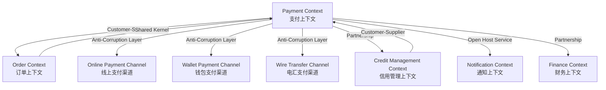
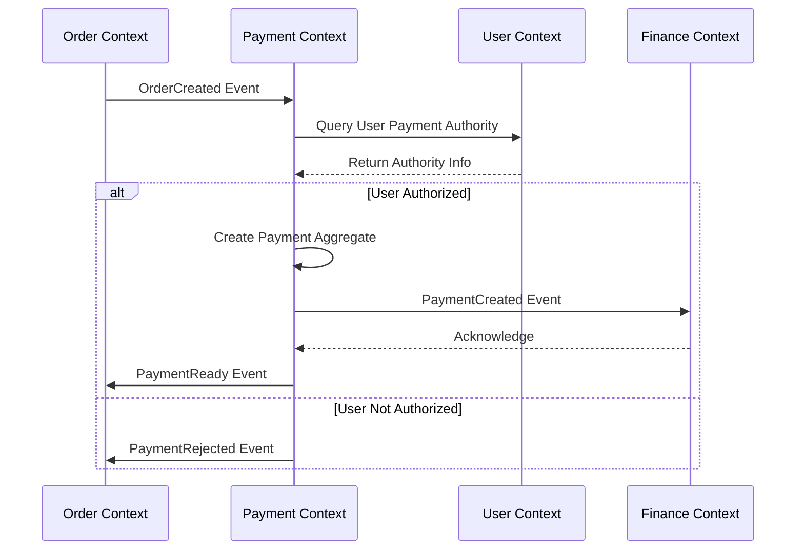
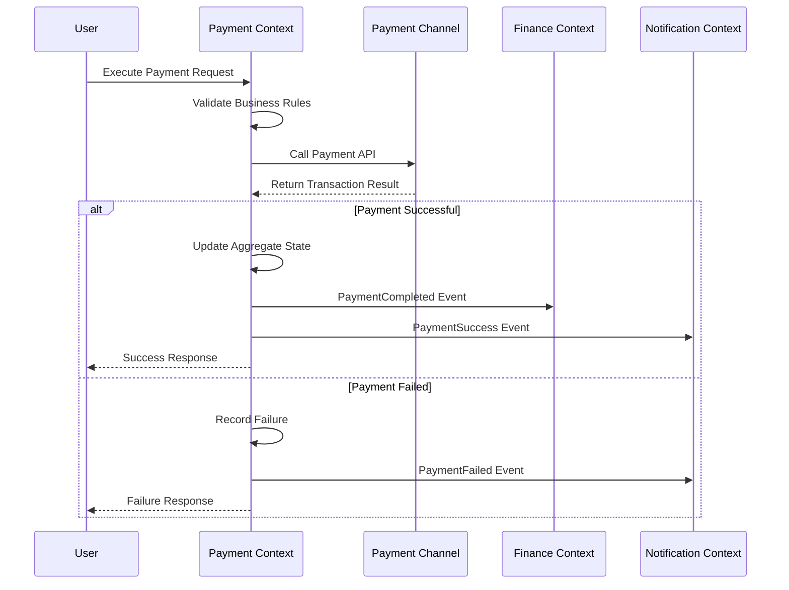
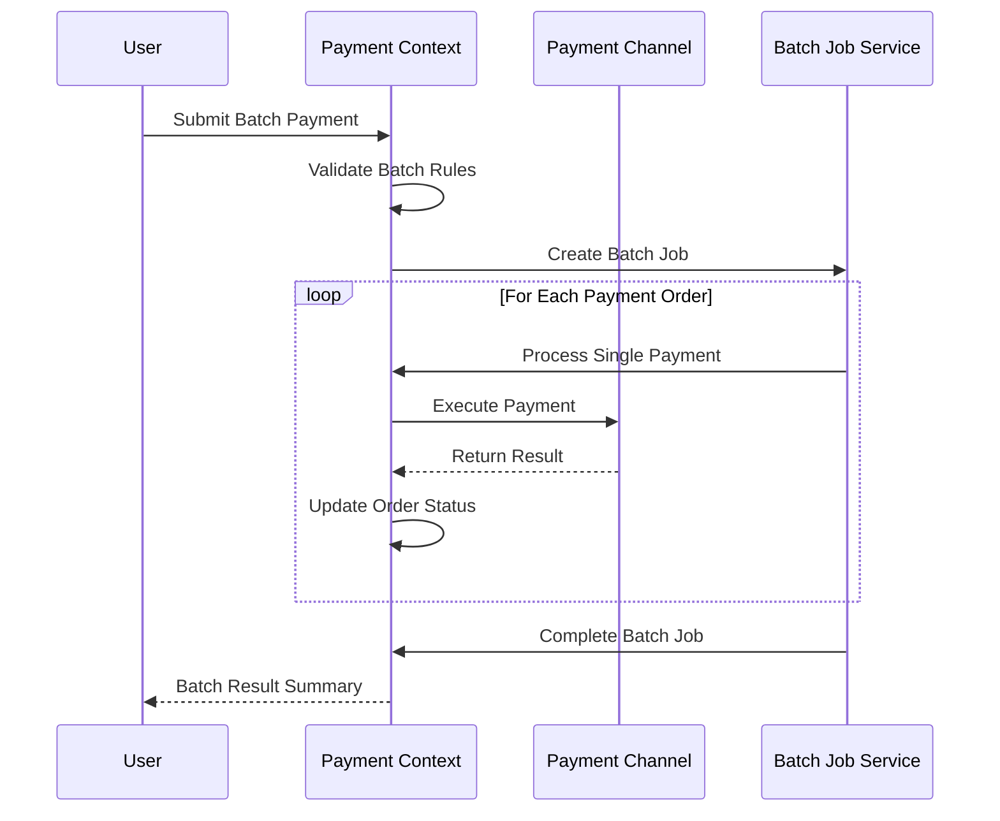
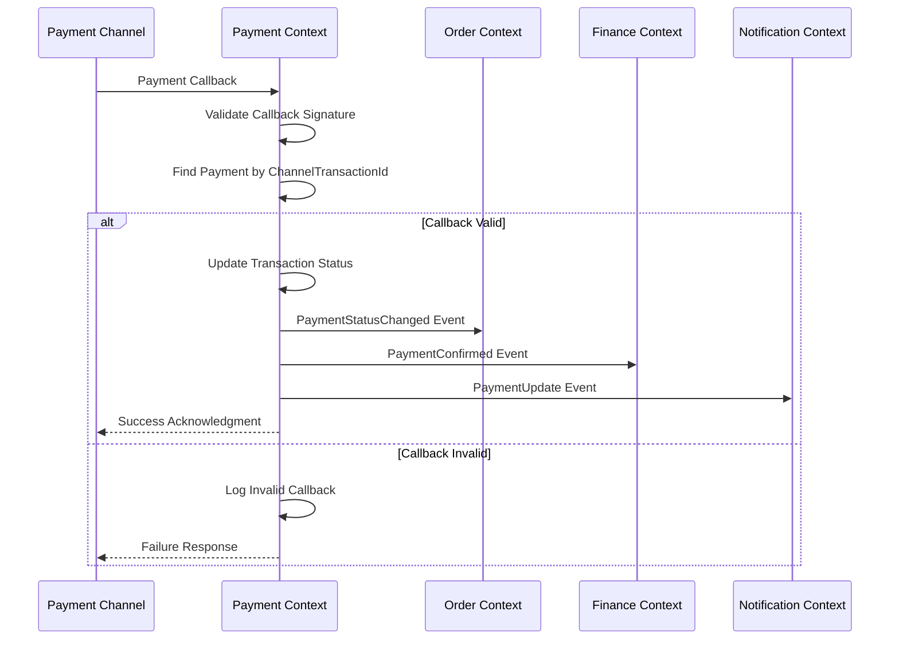
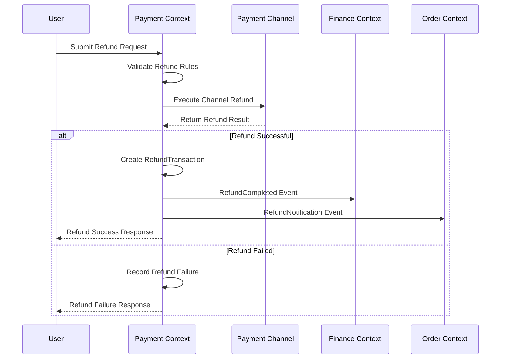

# Payment Context - 集成设计文档

## 文档信息
| 项目 | 内容 |
|------|------|
| **文档名称** | Payment上下文集成设计文档 |
| **文档版本** | v4.0 |
| **创建日期** | 2025年9月26日 |
| **更新日期** | 2025年9月27日 |
| **术语基准** | 全局词汇表 v4.0 |
| **上下文基准** | 支付上下文设计 v4.0 |
| **领域依赖** | 支付领域层设计 v4.0, 支付应用层设计 v4.0, 支付基础设施层设计 v4.0 |

> **设计说明**: 基于支付上下文的完整设计，定义与外部上下文和系统的集成方案

## 集成概览

### 上下文映射图


### 集成关系总览

| 上下文名称 | 关系方向 | 映射模式 | 集成方式 | 数据流向 |
|------------|----------|----------|----------|----------|
| Order Context | 双向 | Customer-Supplier + Shared Kernel | REST API + Event | 订单信息→支付，支付状态→订单 |
| Credit Management Context | 双向 | Partnership | REST API + Event | 信用信息→支付，还款信息→信用 |
| Finance Context | 双向 | Partnership | Event Driven | 支付事件→财务，财务确认→支付 |
| Notification Context | 单向发出 | Open Host Service | Event Publishing | 支付事件→通知 |
| Online Payment Channel | 双向 | Anti-Corruption Layer | HTTP API + Callback | 支付请求→渠道，支付结果→支付 |
| Wallet Payment Channel | 双向 | Anti-Corruption Layer | Internal API | 支付请求→钱包，支付结果→支付 |
| Wire Transfer Channel | 双向 | Anti-Corruption Layer | Proof Upload + Verification | 凭证上传→验证，验证结果→支付 |

## 上下文映射详情

### Order Context 集成

#### 映射关系定义
- **映射模式**: Customer-Supplier + Shared Kernel
- **关系性质**: Payment作为Customer（下游），Order作为Supplier（上游）
- **业务依赖**: 支付单创建依赖订单信息，订单状态更新依赖支付结果
- **数据共享**: OrderId作为关键关联标识，支付类型与订单阶段对应

#### 集成接口设计

**服务接口定义**:
```java
// 订单信息查询接口
@FeignClient(name = "order-service", path = "/api/v1/orders")
public interface OrderServiceClient {
    
    @GetMapping("/{orderId}")
    OrderInfoResponse getOrderInfo(@PathVariable("orderId") String orderId);
    
    @PostMapping("/{orderId}/payment-validation")
    PaymentValidationResponse validatePayment(@PathVariable("orderId") String orderId, 
                                            @RequestBody PaymentValidationRequest request);
    
    @PostMapping("/{orderId}/payment-status")
    void updatePaymentStatus(@PathVariable("orderId") String orderId,
                           @RequestBody PaymentStatusUpdateRequest request);
}

// 订单信息响应
public class OrderInfoResponse {
    private String orderId;
    private String resellerId;
    private String resellerName;
    private BigDecimal totalAmount;
    private String currency;
    private String orderStatus;
    private LocalDateTime paymentDeadline;
    private String businessType;
    private PaymentTypeInfo paymentTypeInfo;
    private ProductionStageInfo productionInfo;
    private DeliveryInfo deliveryInfo;
}
```

**事件接口定义**:
```json
// 订单事件格式
{
  "eventType": "OrderCreated",
  "eventId": "evt_order_20250927001",
  "aggregateId": "order_20250927001",
  "eventData": {
    "orderId": "order_20250927001",
    "resellerId": "reseller_001", 
    "totalAmount": 150000.00,
    "currency": "CNY",
    "paymentDeadline": "2025-10-27T23:59:59",
    "requiredPayments": [
      {
        "paymentType": "ADVANCE_PAYMENT",
        "amount": 75000.00,
        "dueDate": "2025-10-01T23:59:59"
      },
      {
        "paymentType": "FINAL_PAYMENT", 
        "amount": 75000.00,
        "dueDate": "2025-11-15T23:59:59"
      }
    ]
  },
  "occurredOn": "2025-09-27T10:30:00",
  "version": "v1.0"
}
```

#### 防腐层设计 (Anti-Corruption Layer)

**适配器模式**:
```java
// 信用系统适配器接口
public interface CreditSystemAdapter {
    /**
     * 查询信用记录详情
     */
    CreditRecordInfo queryCreditRecord(CreditRecordId creditRecordId);
    
    /**
     * 验证信用还款条件
     */
    RepaymentValidationResult validateCreditRepayment(CreditRecordId creditRecordId, Money repaymentAmount);
    
    /**
     * 通知信用系统还款完成
     */
    void notifyCreditRepayment(CreditRepaymentNotification notification);
    
    /**
     * 查询经销商信用额度
     */
    CreditLimitInfo queryCreditLimit(ResellerId resellerId);
}
```

**数据转换规则**:
- Credit Context的CreditAmount -> Payment Context的Money
- Credit Context的RepaymentPlan -> Payment Context的PaymentSchedule
- Credit Context的CreditStatus -> Payment Context的信用支付状态判断

### Finance Context 集成

#### 映射关系定义
- **映射模式**: Downstream Customer (下游客户模式)
- **关系性质**: Finance Context作为上游，Payment Context作为下游客户
- **业务依赖**: 支付数据为财务核算和对账提供基础数据
- **数据流向**: Payment -> Finance (支付流水、对账数据)

#### 集成接口设计

**财务集成服务接口**:
```java
// 财务系统事件发布
@Component
public class FinanceEventPublisher {
    
    @EventListener
    public void handlePaymentCompleted(PaymentCompletedEvent event) {
        FinanceAccountingEvent accountingEvent = FinanceAccountingEvent.builder()
            .paymentId(event.getPaymentId().getValue())
            .transactionType("PAYMENT_RECEIVED")
            .amount(event.getAmount().getAmount())
            .currency(event.getAmount().getCurrency().getCode())
            .accountingDate(LocalDate.now())
            .businessType(event.getBusinessType().getCode())
            .resellerId(event.getResellerId().getValue())
            .build();
            
        eventPublisher.publish(accountingEvent);
    }
    
    @EventListener  
    public void handleRefundCompleted(RefundCompletedEvent event) {
        FinanceAccountingEvent accountingEvent = FinanceAccountingEvent.builder()
            .paymentId(event.getPaymentId().getValue())
            .transactionType("REFUND_PAID")
            .amount(event.getRefundAmount().getAmount().negate())
            .currency(event.getRefundAmount().getCurrency().getCode())
            .accountingDate(LocalDate.now())
            .businessType(event.getBusinessType().getCode())
            .resellerId(event.getResellerId().getValue())
            .build();
            
        eventPublisher.publish(accountingEvent);
    }
}
```

**事件接口定义**:
```json
// 财务核算事件
{
  "eventType": "FinanceAccountingEvent", 
  "eventId": "evt_finance_20250927001",
  "aggregateId": "payment_20250927001",
  "eventData": {
    "paymentId": "payment_20250927001",
    "transactionType": "PAYMENT_RECEIVED", // PAYMENT_RECEIVED/REFUND_PAID
    "amount": 100000.00,
    "currency": "CNY",
    "accountingDate": "2025-09-27",
    "businessType": "PRODUCTION_ORDER", 
    "paymentMethod": "BANK_TRANSFER",
    "resellerId": "reseller_001",
    "channelInfo": {
      "channelType": "BANK",
      "channelCode": "ICBC", 
      "transactionId": "tx_20250927001"
    }
  },
  "occurredOn": "2025-09-27T14:30:00",
  "version": "v1.0"
}
```

### Notification Context 集成

#### 映射关系定义
- **映射模式**: Open Host Service (开放主机服务模式)
- **关系性质**: Payment Context作为事件发布者，Notification Context作为消费者
- **业务依赖**: 支付状态变更驱动通知发送
- **数据流向**: Payment -> Notification (支付事件、通知内容)

#### 集成接口设计

**通知事件发布**:
```java
// 支付通知事件发布器
@Component
public class PaymentNotificationEventPublisher {
    private final ApplicationEventPublisher eventPublisher;
    
    @EventListener
    public void handlePaymentCompleted(PaymentCompletedEvent event) {
        PaymentNotificationEvent notificationEvent = PaymentNotificationEvent.builder()
            .notificationType(NotificationType.PAYMENT_SUCCESS)
            .recipientId(event.getResellerId().getValue())
            .templateId("payment_success_template")
            .templateData(buildPaymentSuccessData(event))
            .channels(Arrays.asList(Channel.SMS, Channel.EMAIL, Channel.APP_PUSH))
            .priority(Priority.HIGH)
            .build();
            
        eventPublisher.publishEvent(notificationEvent);
    }
    
    @EventListener
    public void handlePaymentFailed(PaymentFailedEvent event) {
        PaymentNotificationEvent notificationEvent = PaymentNotificationEvent.builder()
            .notificationType(NotificationType.PAYMENT_FAILED)
            .recipientId(event.getResellerId().getValue())
            .templateId("payment_failed_template")
            .templateData(buildPaymentFailedData(event))
            .channels(Arrays.asList(Channel.SMS, Channel.APP_PUSH))
            .priority(Priority.URGENT)
            .build();
            
        eventPublisher.publishEvent(notificationEvent);
    }
}
```

**事件接口定义**:
```json
// 支付通知事件
{
  "eventType": "PaymentNotificationEvent",
  "eventId": "evt_notify_20250927001", 
  "aggregateId": "payment_20250927001",
  "eventData": {
    "notificationType": "PAYMENT_SUCCESS",
    "recipientId": "reseller_001",
    "templateId": "payment_success_template",
    "templateData": {
      "paymentId": "payment_20250927001",
      "orderNumber": "ORD20250927001",
      "amount": 100000.00,
      "currency": "CNY",
      "paymentTime": "2025-09-27 14:30:00",
      "paymentMethod": "银行转账",
      "businessType": "生产订单"
    },
    "channels": ["SMS", "EMAIL", "APP_PUSH"],
    "priority": "HIGH"
  },
  "occurredOn": "2025-09-27T14:30:00",
  "version": "v1.0"
}
```

#### 防腐层设计

**通知适配器**:
```java
@Component
public class NotificationSystemAdapter {
    
    public void sendPaymentNotification(PaymentNotificationEvent event) {
        try {
            NotificationRequest request = NotificationRequest.builder()
                .recipientId(event.getRecipientId())
                .templateId(event.getTemplateId())
                .templateData(event.getTemplateData())
                .channels(event.getChannels())
                .priority(event.getPriority())
                .businessType("PAYMENT")
                .build();
                
            notificationClient.sendNotification(request);
            
        } catch (Exception e) {
            log.error("发送支付通知失败", e);
            // 记录失败事件，支持重试机制
            recordNotificationFailure(event, e);
        }
    }
}
```

### 2. Payment ↔ User Context (支付-用户上下文映射)

#### 映射关系类型(Mapping Type)
Conformist Pattern (顺从者模式)
- Payment Context 遵从 User Context 的用户模型

#### 集成方式(Integration Method)
- **只读访问**: 只读取用户信息，不修改用户数据
- **缓存机制**: 缓存常用用户信息减少调用
- **权限验证**: 验证用户支付权限

#### 共享语言(Shared Language)
```text
采用User Context的语言:
- CompanyUserId: 企业用户ID
- UserType: 用户类型 (个人/企业)
- PaymentAuthority: 支付权限级别
- CompanyInfo: 企业基本信息
```

#### API契约(API Contract)
```java
// 获取用户支付权限
GET /api/v1/users/{userId}/payment-authority
Response: {
    "userId": "string",
    "userType": "string",
    "paymentLimit": "decimal",
    "authorizedChannels": ["string"],
    "requiresApproval": "boolean"
}

// 验证支付权限
POST /api/v1/users/{userId}/verify-payment
Request: {
    "paymentAmount": "decimal",
    "paymentChannel": "string"
}
Response: {
    "authorized": "boolean",
    "approvalRequired": "boolean",
    "approvers": ["string"]
}
```

### 3. Payment ↔ Finance Context (支付-财务上下文映射)

#### 映射关系类型(Mapping Type)  
Partnership Pattern (合作伙伴模式) with Daily Reconciliation
- 两个上下文平等协作，共同完成财务处理
- 实现每日对账和差异处理机制
- 支持多种支付方式的财务核算

#### 集成方式(Integration Method)
- **双向事件**: 支付完成触发财务记录，财务确认触发支付确认
- **数据一致性**: 通过Saga模式保证数据最终一致性
- **对账机制**: 定期对账确保数据准确性

#### 共享语言(Shared Language)
```text
共同定义的概念:
- AccountingEntry: 会计分录
- TransactionType: 交易类型  
- ReconciliationRecord: 对账记录
- FinancialPeriod: 财务期间
```

#### 事件集成(Event Integration)
```text
发送到Finance Context:
- PaymentCreated: 支付创建，生成预收款分录
- PaymentCompleted: 支付完成，生成收款分录
- RefundCompleted: 退款完成，生成退款分录

接收自Finance Context:  
- AccountingEntryConfirmed: 会计分录确认
- ReconciliationCompleted: 对账完成确认
- FinancialPeriodClosed: 财务期间关闭
```

### 4. Payment ↔ Notification Context (支付-通知上下文映射)

#### 映射关系类型(Mapping Type)
Open Host Service Pattern (开放主机服务模式)  
- Payment Context 作为服务提供方
- Notification Context 作为消费方

#### 集成方式(Integration Method)
- **标准化事件**: 提供标准化的支付事件接口
- **多渠道通知**: 支持短信、邮件、APP推送等多种通知方式
- **模板化消息**: 预定义通知消息模板

#### Published Events (发布的事件)
```text
支付相关事件:
- PaymentCreated: 支付创建通知
- PaymentInProgress: 支付进行中通知  
- PaymentCompleted: 支付成功通知
- PaymentFailed: 支付失败通知
- RefundCompleted: 退款完成通知
- PaymentDeadlineApproaching: 支付截止时间临近提醒
```

### 5. Payment ↔ External Payment Providers & Credit Management (支付-外部支付提供商和信用管理映射)

#### 映射关系类型(Mapping Type)
Anticorruption Layer Pattern (防腐层模式)
- 通过适配器层隔离外部系统的复杂性和差异性
- 支持B2B大额支付场景
- 集成企业信用管理功能

#### 集成方式(Integration Method)
- **统一接口**: 通过PaymentChannelAdapter提供统一接口
- **协议转换**: 将内部领域对象转换为外部API协议
- **错误映射**: 将外部错误码映射为内部错误类型

#### 外部系统适配(External System Adaptation)
```text
B2B银联支付适配器 (UnionPayB2BAdapter):
- 企业网银支付接入
- 大额支付处理
- 支付结果异步确认
- 转账凭证管理
- 退款处理

企业钱包适配器 (EnterpriseWalletAdapter):
- 企业内部资金账户管理
- 余额查询和支付
- 资金操作记录
- 额度控制

电汇支付适配器 (BankTransferAdapter):
- 银行账户验证
- 转账信息生成
- 凭证上传和确认
- 退款处理

信用支付适配器 (CreditPaymentAdapter):
- 信用额度查询
- 信用支付处理
- 还款计划生成
- 逾期管理

微信支付适配器 (WechatChannelAdapter):
- 统一下单接口
- 支付结果通知
- 订单查询接口
- 退款申请接口

银联适配器 (UnionPayChannelAdapter):
- B2B网银支付
- 企业账户验证
- 大额支付处理
- 批量代付
```

## 业务流程设计(Business Process Design)

### 核心业务流程时序图(Core Business Process Sequence Diagrams)

#### 1. 支付单创建流程(Payment Order Creation Flow)



#### 2. 支付执行流程(Payment Execution Flow)



#### 3. 批量支付流程(Batch Payment Flow)



#### 4. 支付回调处理流程(Payment Callback Processing Flow)



#### 5. 退款处理流程(Refund Processing Flow)



## 特殊业务流程处理(Special Business Process Handling)

### 合并支付处理(Batch Payment Processing)
```text
业务规则：
- 同一经销商多个支付单合并
- 支持不同支付类型组合
- 统一支付渠道处理
- 金额自动分配机制

状态同步：
- 批量更新支付状态
- 同步通知相关上下文
- 处理部分成功场景
```

### 信用支付处理(Credit Payment Processing)
```text
信用额度管理：
- 与信用管理上下文实时同步
- 额度占用和释放机制
- 还款计划自动生成
- 逾期处理和预警

还款流程：
- 自动创建还款支付单
- 多渠道还款支持
- 还款结果实时同步
- 信用记录更新
```

## 数据一致性策略(Data Consistency Strategy)

### Saga模式应用(Saga Pattern Application)

#### 支付完成Saga流程
```text
Saga Steps:
1. 更新支付单状态为已支付
2. 通知订单服务更新订单状态  
3. 创建财务会计分录
4. 发送支付成功通知

Compensation Steps:
1. 回滚支付单状态
2. 回滚订单状态
3. 删除会计分录  
4. 发送支付失败通知
```

#### 退款Saga流程
```text  
Saga Steps:
1. 创建退款交易记录
2. 调用渠道退款接口
3. 更新支付单退款金额
4. 通知财务创建退款分录
5. 通知订单服务退款完成

Compensation Steps:
1. 删除退款交易记录
2. 撤销渠道退款 (如果支持)
3. 回滚支付单退款金额
4. 删除退款会计分录
5. 通知订单服务退款失败
```

## 监控和追踪(Monitoring and Tracing)

### 跨上下文追踪(Cross-Context Tracing)
```text
追踪标识:
- TraceId: 全局追踪标识，跨所有上下文传递
- SpanId: 操作范围标识，标识具体操作
- CorrelationId: 业务关联标识，关联业务流程

监控指标:
- 跨上下文调用延迟
- 事件处理成功率
- 数据一致性检查结果
- 异常和错误统计
```

### 集成健康检查(Integration Health Check)
```text
检查项目:
- 各上下文API可用性
- 事件消息队列健康状态  
- 数据库连接状态
- 外部支付渠道可用性

告警策略:
- 集成失败超过阈值时告警
- 数据不一致时告警
- 关键业务流程中断时告警
```

## 设计验证清单

### 映射关系验证
- [x] 上下文映射模式选择合理 (Customer-Supplier, Conformist, Partnership等)
- [x] 集成接口设计清晰完整 (REST API + 领域事件)
- [x] 数据转换规则正确有效 (防腐层模式)
- [x] 防腐层保护内部模型纯净性

### 流程完整性验证  
- [x] 跨上下文流程设计完整 (支付创建到完成全链路)
- [x] 异常和补偿机制完善 (Saga模式实现)
- [x] 数据一致性策略可行 (最终一致性 + 事件驱动)
- [x] 性能和可用性满足要求

### 技术实现验证
- [x] 集成技术选型合适 (REST + MQ + 适配器模式)
- [x] 配置和代码示例正确
- [x] 监控和治理策略完善
- [x] 安全考虑充分周全

### 术语一致性验证
- [x] 接口定义使用标准业务术语
- [x] 数据模型映射保持术语一致
- [x] 文档描述符合全局词汇表
- [x] 代码实现体现业务语义

---

**文档状态**: ✅ 已完成  
**版本**: v3.0  
**最后更新**: 2024年12月19日  
**术语基准**: 全局词汇表 v3.0, 支付上下文设计 v3.0  
**审核状态**: 待系统集成测试