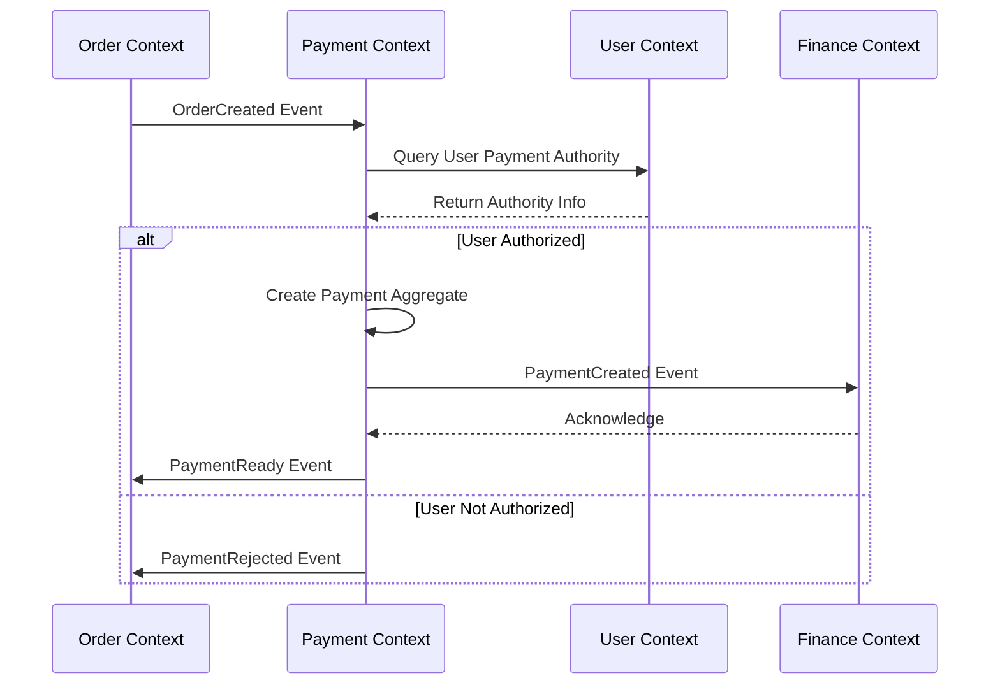
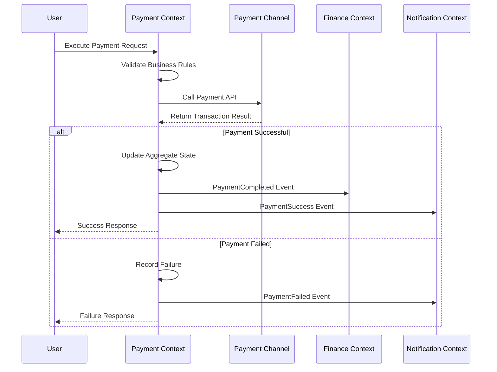
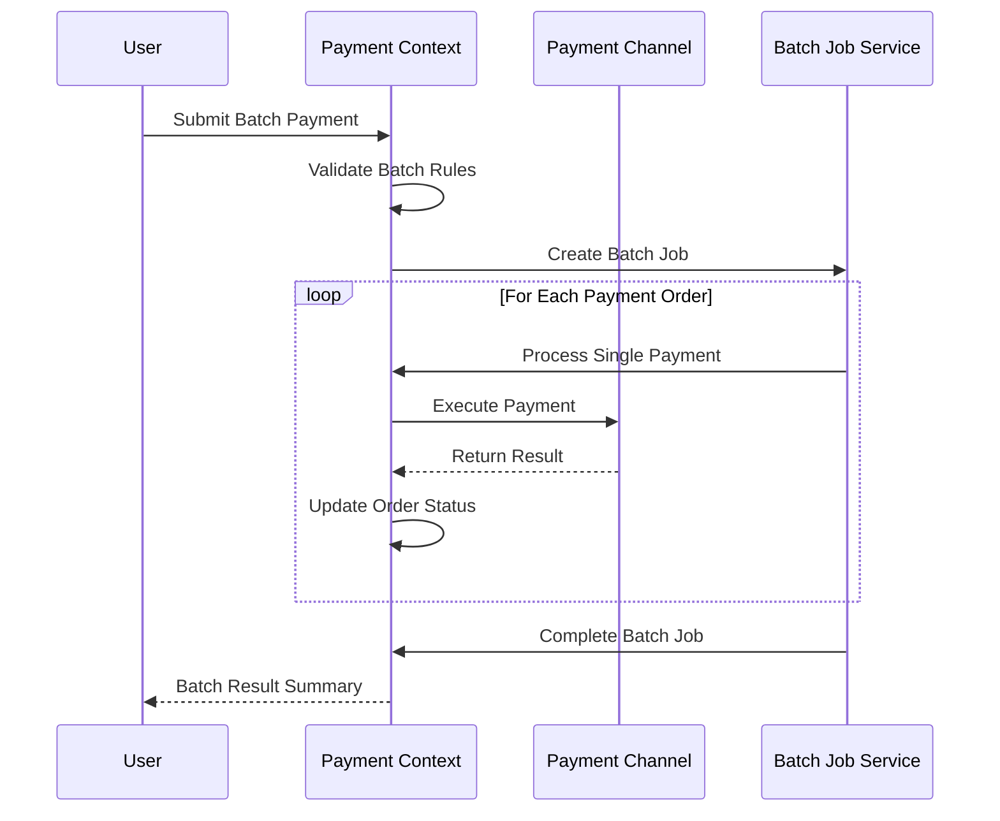
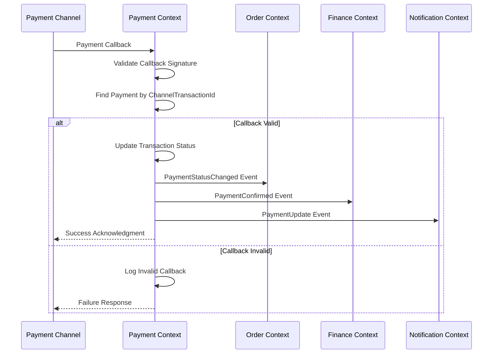
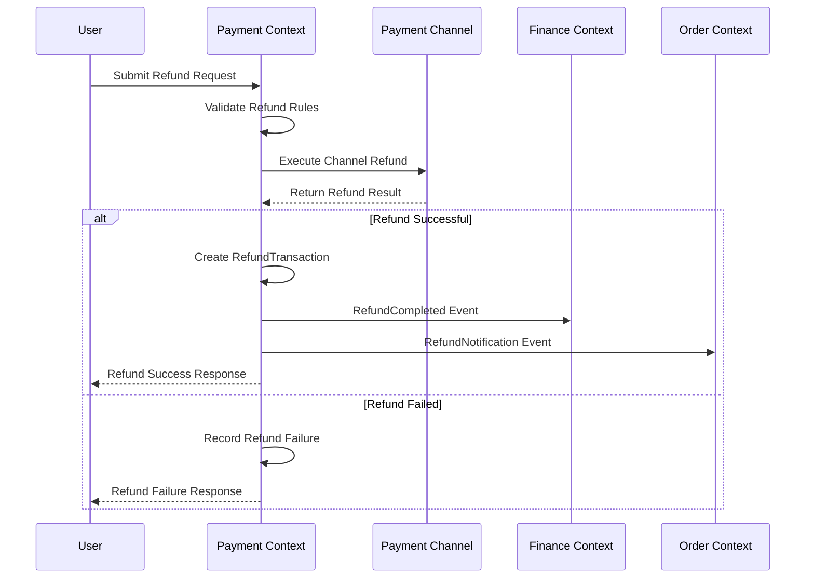

# Payment Context Mapping (支付上下文映射)

## 上下文映射关系设计文档

## 上下文映射概览(Context Map Overview)

### 核心映射关系(Core Mapping Relationships)
```text
Payment Context (支付上下文) 作为核心支付处理中心:
├── Order Context (订单上下文) - Customer/Supplier 关系
├── User Context (用户上下文) - Conformist 关系  
├── Finance Context (财务上下文) - Partner 关系
├── Notification Context (通知上下文) - Open Host Service 关系
└── External Payment Providers (外部支付提供商) - Anticorruption Layer 关系
```

## 详细映射关系(Detailed Mapping Relationships)

### 1. Payment ↔ Order Context (支付-订单上下文映射)

#### 映射关系类型(Mapping Type)
Customer/Supplier Pattern (客户-供应商模式) with Collaborative Partnership
- Payment Context 作为 Customer (下游)
- Order Context 作为 Supplier (上游)
- 双方协同配合完成分阶段支付业务

#### 集成方式(Integration Method)
- **同步调用**: REST API调用获取订单信息
- **异步事件**: 接收订单状态变更事件
- **数据共享**: 共享订单ID作为关联键

#### 共享语言(Shared Language)
```text
共享概念:
- OrderId: 订单标识符 (来自Order Context)
- CompanyUserId: 企业用户标识符 (来自Order Context)  
- OrderAmount: 订单金额 (来自Order Context)
- PaymentStatus: 支付状态 (Payment Context定义)
```

#### API契约(API Contract)
```java
// 从Order Context获取订单信息
GET /api/v1/orders/{orderId}
Response: {
    "orderId": "string",
    "companyUserId": "string", 
    "totalAmount": "decimal",
    "currency": "string",
    "orderStatus": "string",
    "paymentDeadline": "datetime",
    "businessType": "string",
    "paymentType": "string", // 预付款/尾款/其他费用
    "productionStage": "string", // 生产阶段
    "deliveryInfo": {
        "deliveryType": "string", // 全部发货/部分发货
        "deliveryProgress": "decimal" // 发货进度
    }

// 向Order Context发送支付状态
POST /api/v1/orders/{orderId}/payment-status
Request: {
    "paymentId": "string",
    "paymentStatus": "string",
    "paidAmount": "decimal",
    "transactionTime": "datetime"
}
```

#### 事件集成(Event Integration)
```text
接收事件 (从Order Context):
- OrderCreated: 订单创建，触发支付单生成
- OrderCancelled: 订单取消，触发支付取消
- OrderAmountChanged: 订单金额变更，触发支付调整

发送事件 (到Order Context):
- PaymentCompleted: 支付完成通知
- PaymentFailed: 支付失败通知  
- RefundCompleted: 退款完成通知
```

### 2. Payment ↔ User Context (支付-用户上下文映射)

#### 映射关系类型(Mapping Type)
Conformist Pattern (顺从者模式)
- Payment Context 遵从 User Context 的用户模型

#### 集成方式(Integration Method)
- **只读访问**: 只读取用户信息，不修改用户数据
- **缓存机制**: 缓存常用用户信息减少调用
- **权限验证**: 验证用户支付权限

#### 共享语言(Shared Language)
```text
采用User Context的语言:
- CompanyUserId: 企业用户ID
- UserType: 用户类型 (个人/企业)
- PaymentAuthority: 支付权限级别
- CompanyInfo: 企业基本信息
```

#### API契约(API Contract)
```java
// 获取用户支付权限
GET /api/v1/users/{userId}/payment-authority
Response: {
    "userId": "string",
    "userType": "string",
    "paymentLimit": "decimal",
    "authorizedChannels": ["string"],
    "requiresApproval": "boolean"
}

// 验证支付权限
POST /api/v1/users/{userId}/verify-payment
Request: {
    "paymentAmount": "decimal",
    "paymentChannel": "string"
}
Response: {
    "authorized": "boolean",
    "approvalRequired": "boolean",
    "approvers": ["string"]
}
```

### 3. Payment ↔ Finance Context (支付-财务上下文映射)

#### 映射关系类型(Mapping Type)  
Partnership Pattern (合作伙伴模式) with Daily Reconciliation
- 两个上下文平等协作，共同完成财务处理
- 实现每日对账和差异处理机制
- 支持多种支付方式的财务核算

#### 集成方式(Integration Method)
- **双向事件**: 支付完成触发财务记录，财务确认触发支付确认
- **数据一致性**: 通过Saga模式保证数据最终一致性
- **对账机制**: 定期对账确保数据准确性

#### 共享语言(Shared Language)
```text
共同定义的概念:
- AccountingEntry: 会计分录
- TransactionType: 交易类型  
- ReconciliationRecord: 对账记录
- FinancialPeriod: 财务期间
```

#### 事件集成(Event Integration)
```text
发送到Finance Context:
- PaymentCreated: 支付创建，生成预收款分录
- PaymentCompleted: 支付完成，生成收款分录
- RefundCompleted: 退款完成，生成退款分录

接收自Finance Context:  
- AccountingEntryConfirmed: 会计分录确认
- ReconciliationCompleted: 对账完成确认
- FinancialPeriodClosed: 财务期间关闭
```

### 4. Payment ↔ Notification Context (支付-通知上下文映射)

#### 映射关系类型(Mapping Type)
Open Host Service Pattern (开放主机服务模式)  
- Payment Context 作为服务提供方
- Notification Context 作为消费方

#### 集成方式(Integration Method)
- **标准化事件**: 提供标准化的支付事件接口
- **多渠道通知**: 支持短信、邮件、APP推送等多种通知方式
- **模板化消息**: 预定义通知消息模板

#### Published Events (发布的事件)
```text
支付相关事件:
- PaymentCreated: 支付创建通知
- PaymentInProgress: 支付进行中通知  
- PaymentCompleted: 支付成功通知
- PaymentFailed: 支付失败通知
- RefundCompleted: 退款完成通知
- PaymentDeadlineApproaching: 支付截止时间临近提醒
```

### 5. Payment ↔ External Payment Providers & Credit Management (支付-外部支付提供商和信用管理映射)

#### 映射关系类型(Mapping Type)
Anticorruption Layer Pattern (防腐层模式)
- 通过适配器层隔离外部系统的复杂性和差异性
- 支持B2B大额支付场景
- 集成企业信用管理功能

#### 集成方式(Integration Method)
- **统一接口**: 通过PaymentChannelAdapter提供统一接口
- **协议转换**: 将内部领域对象转换为外部API协议
- **错误映射**: 将外部错误码映射为内部错误类型

#### 外部系统适配(External System Adaptation)
```text
B2B银联支付适配器 (UnionPayB2BAdapter):
- 企业网银支付接入
- 大额支付处理
- 支付结果异步确认
- 转账凭证管理
- 退款处理

企业钱包适配器 (EnterpriseWalletAdapter):
- 企业内部资金账户管理
- 余额查询和支付
- 资金操作记录
- 额度控制

电汇支付适配器 (BankTransferAdapter):
- 银行账户验证
- 转账信息生成
- 凭证上传和确认
- 退款处理

信用支付适配器 (CreditPaymentAdapter):
- 信用额度查询
- 信用支付处理
- 还款计划生成
- 逾期管理

微信支付适配器 (WechatChannelAdapter):
- 统一下单接口
- 支付结果通知
- 订单查询接口
- 退款申请接口

银联适配器 (UnionPayChannelAdapter):
- B2B网银支付
- 企业账户验证
- 大额支付处理
- 批量代付
```

## 业务流程设计(Business Process Design)

### 核心业务流程时序图(Core Business Process Sequence Diagrams)

#### 1. 支付单创建流程(Payment Order Creation Flow)



#### 2. 支付执行流程(Payment Execution Flow)



#### 3. 批量支付流程(Batch Payment Flow)



#### 4. 支付回调处理流程(Payment Callback Processing Flow)



#### 5. 退款处理流程(Refund Processing Flow)



## 特殊业务流程处理(Special Business Process Handling)

### 合并支付处理(Batch Payment Processing)
```text
业务规则：
- 同一经销商多个支付单合并
- 支持不同支付类型组合
- 统一支付渠道处理
- 金额自动分配机制

状态同步：
- 批量更新支付状态
- 同步通知相关上下文
- 处理部分成功场景
```

### 信用支付处理(Credit Payment Processing)
```text
信用额度管理：
- 与信用管理上下文实时同步
- 额度占用和释放机制
- 还款计划自动生成
- 逾期处理和预警

还款流程：
- 自动创建还款支付单
- 多渠道还款支持
- 还款结果实时同步
- 信用记录更新
```

## 数据一致性策略(Data Consistency Strategy)

### Saga模式应用(Saga Pattern Application)

#### 支付完成Saga流程
```text
Saga Steps:
1. 更新支付单状态为已支付
2. 通知订单服务更新订单状态  
3. 创建财务会计分录
4. 发送支付成功通知

Compensation Steps:
1. 回滚支付单状态
2. 回滚订单状态
3. 删除会计分录  
4. 发送支付失败通知
```

#### 退款Saga流程
```text  
Saga Steps:
1. 创建退款交易记录
2. 调用渠道退款接口
3. 更新支付单退款金额
4. 通知财务创建退款分录
5. 通知订单服务退款完成

Compensation Steps:
1. 删除退款交易记录
2. 撤销渠道退款 (如果支持)
3. 回滚支付单退款金额
4. 删除退款会计分录
5. 通知订单服务退款失败
```

## 监控和追踪(Monitoring and Tracing)

### 跨上下文追踪(Cross-Context Tracing)
```text
追踪标识:
- TraceId: 全局追踪标识，跨所有上下文传递
- SpanId: 操作范围标识，标识具体操作
- CorrelationId: 业务关联标识，关联业务流程

监控指标:
- 跨上下文调用延迟
- 事件处理成功率
- 数据一致性检查结果
- 异常和错误统计
```

### 集成健康检查(Integration Health Check)
```text
检查项目:
- 各上下文API可用性
- 事件消息队列健康状态  
- 数据库连接状态
- 外部支付渠道可用性

告警策略:
- 集成失败超过阈值时告警
- 数据不一致时告警
- 关键业务流程中断时告警
```