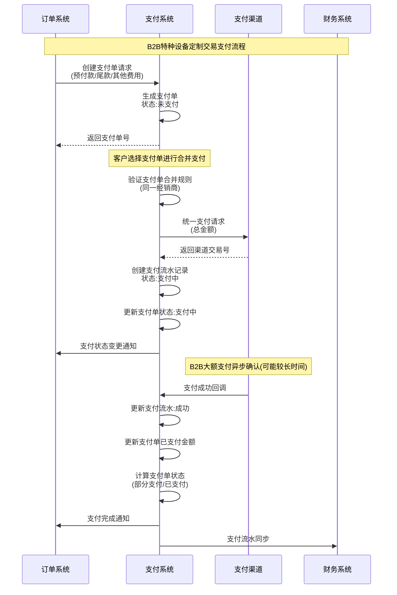
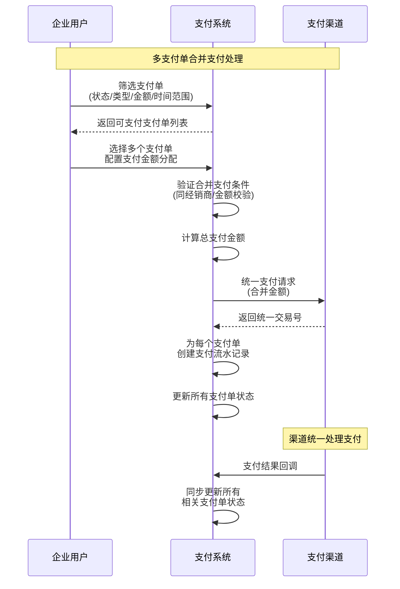
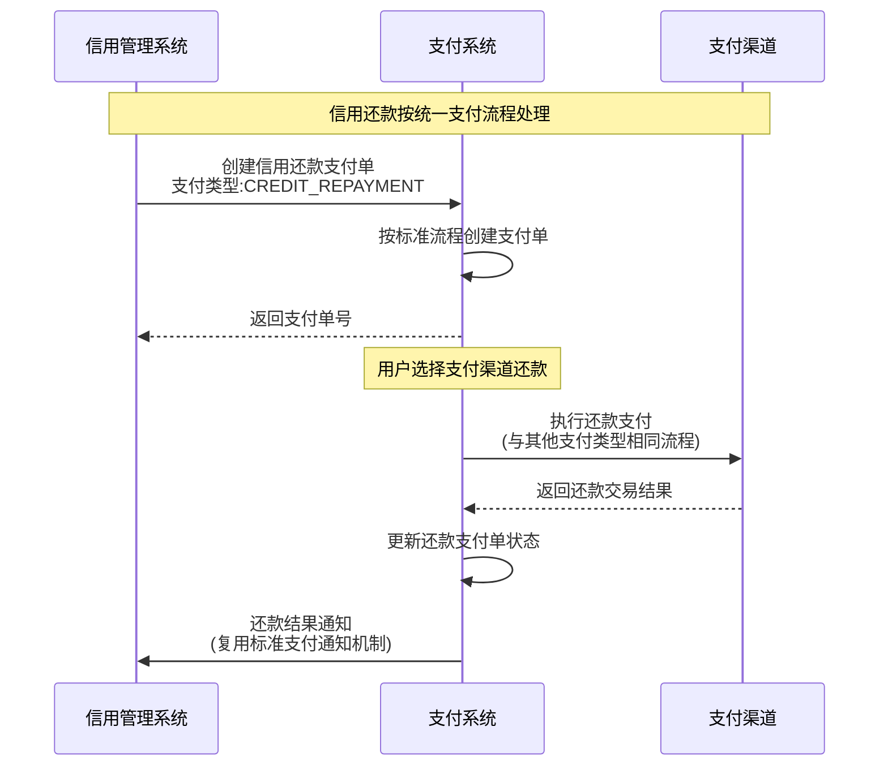
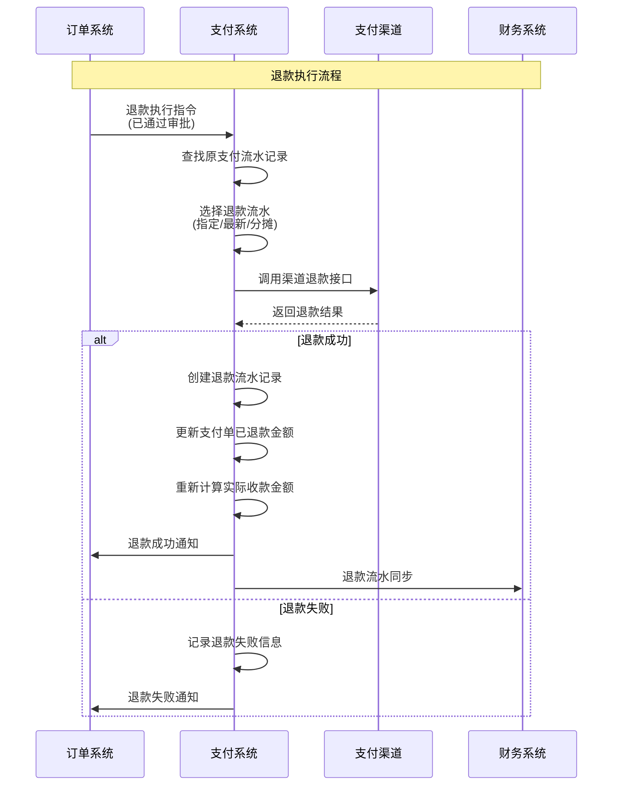
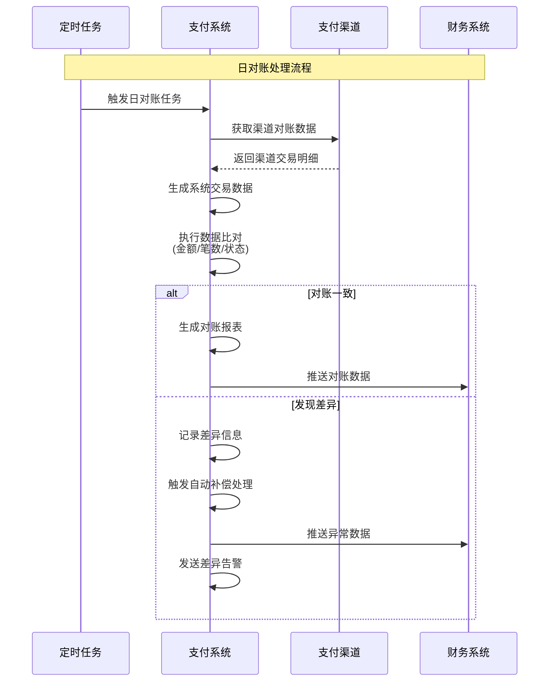

# Payment Context - 上下文集成架构设计文档

## 文档信息
| 项目 | 内容 |
|------|------|
| **文档名称** | Payment上下文集成架构设计文档 |
| **文档版本** | v7.0 |
| **创建日期** | 2024年9月28日 |
| **更新日期** | 2025年9月28日 |
| **需求基准** | 支付模块需求设计文档 v1.4 |
| **术语基准** | 全局词汇表 v5.0 |
| **上下文基准** | 支付上下文设计 v5.0 |
| **领域依赖** | 支付领域层设计 v5.0, 支付应用层设计 v6.0, 支付基础设施层设计 v5.0 |

> **设计原则**: 基于企业间特种设备定制交易系统支付模块需求，重新设计支付上下文与外部系统的集成架构
> **架构重点**: B2B大额支付场景、分阶段支付支持、合并支付处理、信用还款统一管理、多渠道异步处理

## 集成概览

基于企业间特种设备定制交易系统支付模块需求设计文档，支付上下文需要与订单系统、财务系统、信用管理系统以及多种支付渠道进行深度集成，支持B2B大额支付、分阶段支付和信用还款等复杂业务场景。

### 系统集成架构图
```mermaid
graph TB
    subgraph "Payment Context 支付上下文"
        PaymentAggregate[Payment Aggregate<br/>支付聚合根]
        PaymentAppService[Payment Application Service<br/>支付应用服务]
        IntegrationFacade[Integration Facade<br/>集成门面]
        PaymentChannelAdapter[Payment Channel Adapter<br/>支付渠道适配器]
    end
    
    subgraph "Internal Systems 内部系统"
        OrderContext[Order Context<br/>订单上下文]
        FinanceContext[Finance Context<br/>财务上下文] 
        CreditContext[Credit Management Context<br/>信用管理上下文]
        NotificationContext[Notification Context<br/>通知上下文]
    end
    
    subgraph "External Payment Channels 外部支付渠道"
        OnlinePayment[Online Payment Channels<br/>线上支付渠道<br/>(银联/网银/支付宝企业版)]
        WalletPayment[Enterprise Wallet<br/>企业钱包支付<br/>(企业寄存资金)]
        BankTransfer[Bank Transfer<br/>电汇支付<br/>(银行转账)]
        CreditAccount[Credit Account<br/>信用账户<br/>(企业信用额度)]
    end
    
    PaymentAppService --> IntegrationFacade
    IntegrationFacade -->|支付单创建/结果通知| OrderContext
    IntegrationFacade -->|支付流水同步/对账数据| FinanceContext
    IntegrationFacade -->|信用还款处理| CreditContext
    IntegrationFacade -->|支付状态通知| NotificationContext
    
    PaymentAppService --> PaymentChannelAdapter
    PaymentChannelAdapter -->|API调用+回调| OnlinePayment
    PaymentChannelAdapter -->|内部接口调用| WalletPayment
    PaymentChannelAdapter -->|文件上传+确认| BankTransfer
    PaymentChannelAdapter -->|REST API| CreditAccount
```

### 集成接口总览（基于需求设计文档）

| 系统名称 | 接口类型 | 集成方式 | 映射模式 | 核心功能 | 业务特点 |
|----------|----------|----------|----------|----------|----------|
| **订单系统** | 双向集成 | REST API + 事件驱动 | Customer-Supplier | 支付单创建、状态同步、退款执行 | 支持预付款/尾款分阶段支付 |
| **财务系统** | 单向推送 | 消息队列 + 数据同步 | Partnership | 支付流水同步、对账数据传输 | B2B大额交易财务处理 |
| **信用管理系统** | 双向集成 | REST API + 事件驱动 | Partnership | 信用还款处理、额度查询 | 信用还款按统一支付流程处理 |
| **线上支付渠道** | 外部集成 | HTTP API + 异步回调 | Anti-Corruption Layer | 银联、网银等第三方支付 | B2B大额支付，确认时间较长 |
| **钱包支付渠道** | 内部集成 | 内部服务调用 | Conformist | 企业寄存资金支付 | 企业内部资金管理 |
| **电汇支付渠道** | 混合集成 | 文件接口 + 人工确认 | Anti-Corruption Layer | 银行转账凭证处理 | 传统转账方式，需要凭证确认 |
| **信用支付渠道** | 内部集成 | REST API + 事件 | Partnership | 企业信用额度支付 | 基于信用的延期付款 |

## 详细集成设计

### 1. 订单系统集成

#### 集成需求分析
基于企业间特种设备定制交易系统的支付需求，订单系统集成涉及支付单全生命周期管理，特别适应B2B定制化设备交易的支付特点：

| 接口类型 | 接口名称 | 数据流向 | 业务场景 | B2B特色 |
|----------|----------|----------|----------|----------|
| 接收 | 支付单创建接口 | 订单系统 → 支付系统 | 订单确认后创建预付款/尾款支付单 | 支持大额交易、分阶段支付 |
| 发送 | 支付结果通知接口 | 支付系统 → 订单系统 | 支付成功/失败状态同步 | 异步处理大额支付确认 |
| 接收 | 退款执行接口 | 订单系统 → 支付系统 | 接收订单系统退款指令 | 支持部分退款、流水选择 |
| 提供 | 支付状态查询接口 | 订单系统 ← 支付系统 | 订单系统查询支付进度 | 实时查询已支付/待支付金额 |
| 接收 | 合并支付触发 | 用户操作 → 支付系统 | 多支付单合并支付场景 | 跨订单统一支付处理 |
| 发送 | 支付异常通知接口 | 支付系统 → 订单系统 | 支付异常情况通知 | 大额支付风险管控 |
| 提供 | 支付单详情查询接口 | 订单系统 ← 支付系统 | 订单页面展示支付详情 | 显示分次支付历史 |

#### 映射关系设计
- **映射模式**: Customer-Supplier Pattern
  - Payment Context作为Customer（下游消费者）
  - Order Context作为Supplier（上游提供者）
- **数据共享策略**: 共享OrderId作为关键关联标识，但各自维护独立的业务状态
- **一致性保证**: 采用最终一致性 + 补偿机制

#### 集成接口设计

**支付单创建接口**（接收订单系统请求）:
```java
@RestController
@RequestMapping("/api/v1/integration/payment")
public class PaymentIntegrationController {
    
    /**
     * 接收订单系统创建支付单请求
     * 支持预付款、尾款、其他费用等不同支付类型
     */
    @PostMapping("/create")
    public ResponseEntity<PaymentCreationResponse> createPayment(
            @RequestBody PaymentCreationRequest request) {
        
        try {
            // 验证支付单创建请求
            validatePaymentCreationRequest(request);
            
            // 创建支付单
            PaymentCreationCommand command = PaymentCreationCommand.builder()
                .orderId(request.getOrderId())
                .resellerId(request.getResellerId())
                .paymentAmount(request.getPaymentAmount())
                .paymentType(PaymentType.valueOf(request.getPaymentType()))
                .paymentDeadline(request.getPaymentDeadline())
                .businessDesc(request.getBusinessDesc())
                .relatedBusinessId(request.getRelatedBusinessId())
                .relatedBusinessType(request.getRelatedBusinessType())
                .businessExpireDate(request.getBusinessExpireDate())
                .build();
                
            String paymentId = paymentApplicationService.createPayment(command);
            
            return ResponseEntity.ok(PaymentCreationResponse.success(paymentId));
            
        } catch (PaymentCreationException e) {
            return ResponseEntity.badRequest()
                .body(PaymentCreationResponse.failure(e.getMessage()));
        }
    }
}

// 支付单创建请求（基于需求文档4.1.1节）
public class PaymentCreationRequest {
    private String orderId;                    // 关联订单号（必填）
    private String resellerId;                 // 经销商ID（必填）
    private String paymentType;                // 支付类型：ADVANCE_PAYMENT/FINAL_PAYMENT/OTHER_FEE/CREDIT_REPAYMENT
    private BigDecimal paymentAmount;          // 支付金额（必填）
    private LocalDateTime paymentDeadline;     // 支付截止时间（可选）
    private String businessDesc;               // 业务备注（可选）
    private String relatedBusinessId;          // 关联业务ID（可选）
    private String relatedBusinessType;        // 关联业务类型（可选）
    private LocalDateTime businessExpireDate;  // 业务到期日（可选）
}
```

**支付状态通知接口**（向订单系统发送通知）:
```java
/**
 * 订单系统支付状态通知客户端
 * 支付系统主动调用订单系统接口
 */
@Component
public class OrderSystemNotificationClient {
    
    @Retryable(value = {Exception.class}, maxAttempts = 3)
    public void notifyPaymentStatusChange(PaymentStatusChangeEvent event) {
        
        PaymentNotificationRequest request = PaymentNotificationRequest.builder()
            .paymentId(event.getPaymentId())
            .orderId(event.getOrderId())
            .paymentStatus(event.getNewStatus().name())
            .paymentType(event.getPaymentType().name())
            .paidAmount(event.getPaidAmount())
            .remainingAmount(event.getRemainingAmount())
            .paymentTime(event.getPaymentTime())
            .channelInfo(event.getChannelInfo())
            .transactionId(event.getTransactionId())
            .build();
            
        try {
            restTemplate.postForObject(
                "/api/v1/orders/{orderId}/payment-notification", 
                request, 
                Void.class, 
                event.getOrderId()
            );
        } catch (Exception e) {
            log.error("通知订单系统支付状态变更失败: paymentId={}", event.getPaymentId(), e);
            throw e; // 触发重试机制
        }
    }
}

// 支付状态变更通知请求（基于需求文档4.2.1节统一支付流程）
public class PaymentNotificationRequest {
    private String paymentId;                  // 支付单号
    private String orderId;                    // 关联订单号
    private String paymentStatus;              // 支付状态：UNPAID/PAYING/PARTIAL_PAID/PAID/FAILED/STOPPED/FROZEN
    private String paymentType;                // 支付类型
    private BigDecimal paidAmount;             // 已支付金额
    private BigDecimal remainingAmount;        // 待支付金额
    private LocalDateTime paymentTime;         // 支付时间
    private String channelInfo;                // 支付渠道信息
    private String transactionId;              // 支付流水号
}
```

**退款执行接口**（接收订单系统退款指令）:
```java
/**
 * 退款执行接口
 * 接收订单系统审批通过的退款指令（基于需求文档4.8节）
 */
@PostMapping("/api/v1/integration/payment/refund")
public ResponseEntity<RefundExecutionResponse> executeRefund(
        @RequestBody RefundExecutionRequest request) {
    
    try {
        // 验证退款请求
        validateRefundRequest(request);
        
        // 执行退款
        RefundExecutionCommand command = RefundExecutionCommand.builder()
            .refundOrderId(request.getRefundOrderId())
            .paymentId(request.getPaymentId())
            .refundAmount(request.getRefundAmount())
            .refundReason(request.getRefundReason())
            .approvalInfo(request.getApprovalInfo())
            .refundType(RefundType.valueOf(request.getRefundType()))
            .build();
            
        String refundId = paymentApplicationService.executeRefund(command);
        
        return ResponseEntity.ok(RefundExecutionResponse.success(refundId));
        
    } catch (RefundExecutionException e) {
        return ResponseEntity.badRequest()
            .body(RefundExecutionResponse.failure(e.getMessage()));
    }
}

// 退款执行请求（基于需求文档4.8.2节）
public class RefundExecutionRequest {
    private String refundOrderId;              // 订单系统的退款单号（必填）
    private String paymentId;                  // 原支付单号（必填）
    private BigDecimal refundAmount;           // 退款金额（必填）
    private String refundReason;               // 退款原因（必填，由订单系统审批确定）
    private Map<String, Object> approvalInfo;  // 订单系统的审批信息（必填）
    private String refundType;                 // 退款类型：FULL/PARTIAL（必填）
}

// 退款执行响应
public class RefundExecutionResponse {
    private boolean success;                   // 执行结果
    private String refundId;                   // 退款流水号
    private String message;                    // 结果消息
    private LocalDateTime executeTime;         // 执行时间
}
```

**支付状态查询接口**（提供给订单系统）:
```java
/**
 * 支付状态查询接口
 * 订单系统查询支付单详细信息和状态
 */
@GetMapping("/api/v1/integration/payment/{paymentId}/status")
public ResponseEntity<PaymentStatusResponse> getPaymentStatus(
        @PathVariable String paymentId) {
    
    try {
        PaymentStatusQuery query = new PaymentStatusQuery(paymentId);
        PaymentStatusDTO status = paymentQueryService.queryPaymentStatus(query);
        
        PaymentStatusResponse response = PaymentStatusResponse.builder()
            .paymentId(status.getPaymentId())
            .orderId(status.getOrderId())
            .paymentStatus(status.getPaymentStatus())
            .paymentAmount(status.getPaymentAmount())
            .paidAmount(status.getPaidAmount())
            .remainingAmount(status.getRemainingAmount())
            .refundedAmount(status.getRefundedAmount())
            .actualAmount(status.getActualAmount())
            .paymentTransactions(status.getPaymentTransactions())
            .refundTransactions(status.getRefundTransactions())
            .build();
            
        return ResponseEntity.ok(response);
        
    } catch (PaymentNotFoundException e) {
        return ResponseEntity.notFound().build();
    }
}

// 支付状态响应（基于需求文档4.4节数据模型）
public class PaymentStatusResponse {
    private String paymentId;                  // 支付单号
    private String orderId;                    // 关联订单号
    private String paymentStatus;              // 支付状态
    private BigDecimal paymentAmount;          // 支付单总金额
    private BigDecimal paidAmount;             // 已支付金额
    private BigDecimal remainingAmount;        // 待支付金额（paymentAmount - paidAmount）
    private BigDecimal refundedAmount;         // 已退款金额
    private BigDecimal actualAmount;           // 实际收款金额（paidAmount - refundedAmount）
    private List<TransactionInfo> paymentTransactions;  // 支付流水记录
    private List<TransactionInfo> refundTransactions;   // 退款流水记录
    
    public static class TransactionInfo {
        private String transactionId;          // 流水号
        private String transactionType;        // 交易类型：PAYMENT/REFUND
        private BigDecimal transactionAmount;  // 交易金额
        private String paymentChannel;         // 支付渠道
        private String transactionStatus;      // 交易状态
        private LocalDateTime createTime;      // 创建时间
        private LocalDateTime completeTime;    // 完成时间
    }
}
```

### 2. 财务系统集成

#### 集成需求分析
基于企业间特种设备定制交易系统的财务管理需求，财务系统集成主要处理B2B大额交易的财务数据同步和对账管理：

| 接口类型 | 接口名称 | 数据流向 | 业务场景 | B2B特色 |
|----------|----------|----------|----------|----------|
| 发送 | 支付流水实时同步 | 支付系统 → 财务系统 | 实时同步支付交易数据 | 支持大额交易、多渠道分次支付 |
| 发送 | 日对账数据传输 | 支付系统 → 财务系统 | 每日对账数据批量传输 | 预付款/尾款分类统计、异常处理 |
| 接收 | 财务确认反馈 | 财务系统 → 支付系统 | 财务确认支付入账结果 | 大额交易财务审核确认 |
| 提供 | 支付统计查询 | 财务系统 ← 支付系统 | 财务报表数据查询 | 按支付类型、渠道、经销商维度统计 |

#### 映射关系设计
- **映射模式**: Partnership Pattern（合作伙伴模式）
- **数据流向**: 双向数据交换，支付系统主动推送，财务系统定期拉取
- **一致性保证**: Event Sourcing + 最终一致性

#### 集成接口设计

**支付流水实时同步**（基于需求文档4.9节对账管理）:
```java
/**
 * 财务集成事件发布服务
 * 实时同步支付流水到财务系统，支持B2B大额交易财务处理
 */
@Component
public class FinanceIntegrationEventPublisher {
    
    private final ApplicationEventPublisher eventPublisher;
    private final RabbitTemplate rabbitTemplate;
    
    /**
     * 支付完成时同步财务数据
     * 支持合并支付的流水分解同步
     */
    @EventListener
    @Async("financeTaskExecutor")
    public void handlePaymentCompleted(PaymentCompletedEvent event) {
        
        // 创建财务交易消息（基于需求文档4.4.2节支付流水表设计）
        FinanceTransactionMessage message = FinanceTransactionMessage.builder()
            .transactionId(event.getTransactionId())
            .paymentId(event.getPaymentId())
            .transactionType("PAYMENT_RECEIVED")
            .amount(event.getTransactionAmount())
            .currency("CNY")  // 固定人民币
            .resellerId(event.getResellerId())
            .orderId(event.getOrderId())
            .paymentChannel(event.getPaymentChannel())
            .paymentMethod(event.getPaymentMethod())
            .paymentTime(event.getCompleteTime())
            .businessType(event.getPaymentType())  // 预付款/尾款/其他费用/信用还款
            .channelTransactionNumber(event.getChannelTransactionNumber())
            .businessRemark(event.getBusinessRemark())
            .build();
            
        // 发送到财务消息队列
        rabbitTemplate.convertAndSend("finance.exchange", 
                                    "payment.transaction.sync", message);
        
        log.info("已同步支付流水到财务系统: transactionId={}, paymentId={}", 
                event.getTransactionId(), event.getPaymentId());
    }
    
    /**
     * 退款完成时同步财务数据
     * 关联原支付流水，支持部分退款处理
     */
    @EventListener
    @Async("financeTaskExecutor") 
    public void handleRefundCompleted(RefundCompletedEvent event) {
        
        FinanceTransactionMessage message = FinanceTransactionMessage.builder()
            .transactionId(event.getRefundTransactionId())
            .paymentId(event.getPaymentId())
            .originalTransactionId(event.getOriginalTransactionId())
            .transactionType("REFUND_PAID")
            .amount(event.getRefundAmount().negate())  // 退款金额为负数
            .currency("CNY")
            .resellerId(event.getResellerId())
            .orderId(event.getOrderId())
            .paymentChannel(event.getPaymentChannel())
            .refundReason(event.getRefundReason())
            .refundTime(event.getCompleteTime())
            .businessType(event.getPaymentType())
            .businessOrderId(event.getRefundOrderId())  // 订单系统退款单号
            .businessRemark(event.getBusinessRemark())
            .build();
            
        rabbitTemplate.convertAndSend("finance.exchange", 
                                    "refund.transaction.sync", message);
        
        log.info("已同步退款流水到财务系统: transactionId={}, refundAmount={}", 
                event.getRefundTransactionId(), event.getRefundAmount());
    }
}

// 财务交易消息格式（基于需求文档4.4.2节流水表结构）
public class FinanceTransactionMessage {
    private String transactionId;              // 支付流水号
    private String paymentId;                  // 支付单号
    private String originalTransactionId;      // 原流水号（退款时关联）
    private String transactionType;            // 交易类型：PAYMENT_RECEIVED/REFUND_PAID
    private BigDecimal amount;                 // 交易金额（支付为正，退款为负）
    private String currency;                   // 币种，固定为CNY
    private String resellerId;                 // 经销商ID
    private String orderId;                    // 关联订单号
    private String paymentChannel;             // 支付渠道
    private String paymentMethod;              // 具体支付方式
    private LocalDateTime paymentTime;         // 支付完成时间
    private LocalDateTime refundTime;          // 退款完成时间
    private String businessType;               // 业务类型：ADVANCE_PAYMENT/FINAL_PAYMENT/OTHER_FEE/CREDIT_REPAYMENT
    private String channelTransactionNumber;   // 支付渠道交易号
    private String businessOrderId;            // 业务单号（如退款单号）
    private String refundReason;               // 退款原因
    private String businessRemark;             // 业务备注
}
```

**日对账数据接口**（基于需求文档4.9节对账管理）:
```java
/**
 * 财务对账数据提供接口
 * 支持财务系统获取详细的对账数据和统计报表
 */
@RestController
@RequestMapping("/api/v1/integration/finance")
public class FinanceReconciliationController {
    
    /**
     * 获取日对账数据
     * 支持B2B大额支付的复杂对账要求
     */
    @GetMapping("/reconciliation/{date}")
    public ResponseEntity<DailyReconciliationData> getDailyReconciliation(
            @PathVariable @DateTimeFormat(pattern = "yyyy-MM-dd") LocalDate date) {
        
        DailyReconciliationQuery query = new DailyReconciliationQuery(date);
        DailyReconciliationData data = financeQueryService.generateDailyReconciliation(query);
        return ResponseEntity.ok(data);
    }
    
    /**
     * 获取支付统计数据
     * 按业务维度提供财务报表数据
     */
    @PostMapping("/payment-statistics")
    public ResponseEntity<PaymentStatisticsResponse> getPaymentStatistics(
            @RequestBody PaymentStatisticsRequest request) {
        
        PaymentStatisticsResponse statistics = financeQueryService.calculateStatistics(request);
        return ResponseEntity.ok(statistics);
    }
    
    /**
     * 获取异常交易数据
     * 支持财务审核和差异处理
     */
    @GetMapping("/reconciliation/{date}/exceptions")
    public ResponseEntity<List<ExceptionTransaction>> getExceptionTransactions(
            @PathVariable @DateTimeFormat(pattern = "yyyy-MM-dd") LocalDate date) {
        
        List<ExceptionTransaction> exceptions = financeQueryService.findExceptionTransactions(date);
        return ResponseEntity.ok(exceptions);
    }
}

// 日对账数据格式（基于需求文档4.9节）
public class DailyReconciliationData {
    private LocalDate reconciliationDate;      // 对账日期
    private ReconciliationSummary summary;     // 汇总数据
    private List<BusinessTypeSummary> businessTypeSummaries; // 按业务类型汇总
    private List<ChannelSummary> channelSummaries;          // 按渠道汇总
    private List<ResellerSummary> resellerSummaries;        // 按经销商汇总
    private List<TransactionDetail> transactionDetails;      // 交易明细
    private List<ExceptionRecord> exceptionRecords;          // 异常记录
    
    // 汇总数据
    public static class ReconciliationSummary {
        private BigDecimal totalPaymentAmount;     // 总支付金额
        private BigDecimal totalRefundAmount;      // 总退款金额
        private BigDecimal netAmount;              // 净收款金额
        private Integer totalPaymentCount;         // 支付笔数
        private Integer totalRefundCount;          // 退款笔数
        private Integer exceptionCount;            // 异常笔数
    }
    
    // 按业务类型汇总（预付款/尾款分类统计）
    public static class BusinessTypeSummary {
        private String businessType;               // ADVANCE_PAYMENT/FINAL_PAYMENT/OTHER_FEE/CREDIT_REPAYMENT
        private String businessTypeName;           // 业务类型名称
        private BigDecimal paymentAmount;          // 支付金额
        private BigDecimal refundAmount;           // 退款金额
        private BigDecimal netAmount;              // 净收款金额
        private Integer paymentCount;              // 支付笔数
        private Integer refundCount;               // 退款笔数
    }
    
    // 按渠道汇总
    public static class ChannelSummary {
        private String channelCode;                // 渠道代码
        private String channelName;                // 渠道名称
        private BigDecimal paymentAmount;          // 渠道支付金额
        private BigDecimal refundAmount;           // 渠道退款金额
        private Integer paymentCount;              // 支付笔数
        private Integer refundCount;               // 退款笔数
        private List<String> exceptionReasons;     // 异常原因列表
    }
    
    // 按经销商汇总
    public static class ResellerSummary {
        private String resellerId;                 // 经销商ID
        private String resellerName;               // 经销商名称
        private BigDecimal totalPaymentAmount;     // 总支付金额
        private BigDecimal totalRefundAmount;      // 总退款金额
        private Integer orderCount;                // 订单数量
        private Integer paymentCount;              // 支付笔数
    }
}
```

### 3. 信用管理系统集成

#### 集成需求分析
基于企业间特种设备定制交易系统的信用管理需求，信用管理系统集成主要处理信用还款业务，按照统一支付流程处理：

| 接口类型 | 接口名称 | 数据流向 | 业务场景 | 统一处理特色 |
|----------|----------|----------|----------|------------|
| 接收 | 信用还款支付单创建 | 信用系统 → 支付系统 | 创建信用还款支付单 | 支付类型为"信用还款"的普通支付单 |
| 发送 | 还款结果通知 | 支付系统 → 信用系统 | 通知还款成功/失败 | 按标准支付结果通知流程 |
| 提供 | 信用额度查询 | 信用系统 ← 支付系统 | 查询经销商信用额度 | 支持信用支付渠道验证 |

#### 映射关系设计
- **映射模式**: Partnership Pattern（合作伙伴模式）
- **业务依赖**: 信用还款依赖支付执行，支付完成影响信用额度
- **数据一致性**: 强一致性要求，采用分布式事务

#### 集成接口设计

**信用还款支付单创建接口**（基于需求文档4.11节信用还款处理）:
```java
/**
 * 信用管理集成控制器
 * 处理信用还款业务，按统一支付流程处理
 */
@RestController
@RequestMapping("/api/v1/integration/credit")
public class CreditManagementIntegrationController {
    
    /**
     * 接收信用管理系统还款指令
     * 创建支付类型为"信用还款"的普通支付单
     */
    @PostMapping("/repayment")
    public ResponseEntity<CreditRepaymentResponse> createCreditRepaymentPayment(
            @RequestBody CreditRepaymentRequest request) {
        
        try {
            // 验证还款请求
            validateCreditRepaymentRequest(request);
            
            // 创建信用还款支付单（按标准支付单创建流程）
            PaymentCreationCommand command = PaymentCreationCommand.builder()
                .orderId(generateRepaymentOrderId()) // 生成还款业务订单号
                .resellerId(request.getResellerId())
                .paymentAmount(request.getRepaymentAmount())
                .paymentType(PaymentType.CREDIT_REPAYMENT) // 支付类型为信用还款
                .relatedBusinessId(request.getCreditRecordId())
                .relatedBusinessType(RelatedBusinessType.CREDIT_RECORD)
                .businessExpireDate(request.getRepaymentDeadline())
                .businessDesc("信用还款：" + request.getRepaymentReason())
                .build();
                
            String paymentId = paymentApplicationService.createPayment(command);
            
            return ResponseEntity.ok(CreditRepaymentResponse.success(paymentId, 
                "信用还款支付单创建成功，请选择支付渠道完成还款"));
            
        } catch (CreditRepaymentException e) {
            log.error("创建信用还款支付单失败: creditRecordId={}", request.getCreditRecordId(), e);
            return ResponseEntity.badRequest()
                .body(CreditRepaymentResponse.failure(e.getMessage()));
        }
    }
    
    /**
     * 查询经销商信用额度信息
     * 支持信用支付渠道的额度验证
     */
    @GetMapping("/{resellerId}/limit")
    public ResponseEntity<CreditLimitResponse> getCreditLimit(
            @PathVariable String resellerId) {
        
        try {
            CreditLimitInfo limitInfo = creditSystemClient.queryCreditLimit(resellerId);
            
            CreditLimitResponse response = CreditLimitResponse.builder()
                .resellerId(resellerId)
                .totalCreditLimit(limitInfo.getTotalCreditLimit())
                .availableCreditLimit(limitInfo.getAvailableCreditLimit())
                .usedCreditLimit(limitInfo.getUsedCreditLimit())
                .creditStatus(limitInfo.getCreditStatus())
                .creditExpireDate(limitInfo.getCreditExpireDate())
                .build();
                
            return ResponseEntity.ok(response);
            
        } catch (Exception e) {
            log.error("查询经销商信用额度失败: resellerId={}", resellerId, e);
            return ResponseEntity.status(500).build();
        }
    }
}

// 信用还款请求（基于需求文档4.11.2节）
public class CreditRepaymentRequest {
    private String creditRecordId;             // 信用记录ID（必填）
    private String resellerId;                 // 经销商ID（必填）
    private BigDecimal repaymentAmount;        // 还款金额（必填）
    private String repaymentReason;            // 还款原因（必填）
    private LocalDateTime repaymentDeadline;   // 还款截止时间（可选）
    private String businessRemark;             // 业务备注（可选）
}

// 信用还款响应
public class CreditRepaymentResponse {
    private boolean success;                   // 处理结果
    private String paymentId;                  // 支付单号
    private String message;                    // 结果消息
    private LocalDateTime createTime;          // 创建时间
    
    public static CreditRepaymentResponse success(String paymentId, String message) {
        return new CreditRepaymentResponse(true, paymentId, message, LocalDateTime.now());
    }
    
    public static CreditRepaymentResponse failure(String message) {
        return new CreditRepaymentResponse(false, null, message, LocalDateTime.now());
    }
}

// 信用额度响应
public class CreditLimitResponse {
    private String resellerId;                 // 经销商ID
    private BigDecimal totalCreditLimit;       // 总信用额度
    private BigDecimal availableCreditLimit;   // 可用信用额度
    private BigDecimal usedCreditLimit;        // 已使用信用额度
    private String creditStatus;               // 信用状态
    private LocalDateTime creditExpireDate;    // 信用到期时间
}
```

**信用还款结果通知**（基于需求文档4.11.1节统一处理原则）:
```java
/**
 * 信用还款事件处理器
 * 信用还款按标准支付流程处理，复用支付结果通知机制
 */
@Component
public class CreditRepaymentEventHandler {
    
    private final CreditSystemNotificationClient creditSystemClient;
    
    /**
     * 处理信用还款支付成功事件
     * 按标准支付完成事件处理，特殊处理信用还款类型
     */
    @EventListener
    @Async("creditTaskExecutor")
    public void handleCreditRepaymentCompleted(PaymentCompletedEvent event) {
        
        // 仅处理信用还款类型的支付
        if (event.getPaymentType() == PaymentType.CREDIT_REPAYMENT) {
            
            CreditRepaymentNotification notification = CreditRepaymentNotification.builder()
                .creditRecordId(event.getRelatedBusinessId())
                .paymentId(event.getPaymentId())
                .resellerId(event.getResellerId())
                .repaymentAmount(event.getPaidAmount())
                .repaymentTime(event.getPaymentCompletedTime())
                .paymentChannel(event.getPaymentChannel())
                .paymentMethod(event.getPaymentMethod())
                .channelTransactionNumber(event.getChannelTransactionNumber())
                .status("REPAYMENT_COMPLETED")
                .businessRemark(event.getBusinessRemark())
                .build();
                
            // 异步通知信用管理系统
            creditSystemClient.notifyRepaymentResult(notification);
            
            log.info("已通知信用管理系统还款完成: creditRecordId={}, paymentId={}, amount={}", 
                    event.getRelatedBusinessId(), event.getPaymentId(), event.getPaidAmount());
        }
    }
    
    /**
     * 处理信用还款支付失败事件
     * 复用标准支付失败处理流程
     */
    @EventListener 
    @Async("creditTaskExecutor")
    public void handleCreditRepaymentFailed(PaymentFailedEvent event) {
        
        if (event.getPaymentType() == PaymentType.CREDIT_REPAYMENT) {
            
            CreditRepaymentNotification notification = CreditRepaymentNotification.builder()
                .creditRecordId(event.getRelatedBusinessId())
                .paymentId(event.getPaymentId())
                .resellerId(event.getResellerId())
                .repaymentAmount(event.getPaymentAmount())
                .failureReason(event.getFailureReason())
                .failureTime(event.getFailureTime())
                .paymentChannel(event.getPaymentChannel())
                .status("REPAYMENT_FAILED")
                .build();
                
            creditSystemClient.notifyRepaymentResult(notification);
            
            log.warn("已通知信用管理系统还款失败: creditRecordId={}, paymentId={}, reason={}", 
                    event.getRelatedBusinessId(), event.getPaymentId(), event.getFailureReason());
        }
    }
}

// 信用还款结果通知
public class CreditRepaymentNotification {
    private String creditRecordId;             // 信用记录ID
    private String paymentId;                  // 支付单号
    private String resellerId;                 // 经销商ID
    private BigDecimal repaymentAmount;        // 还款金额
    private LocalDateTime repaymentTime;       // 还款完成时间
    private LocalDateTime failureTime;         // 失败时间
    private String paymentChannel;             // 支付渠道
    private String paymentMethod;              // 支付方式
    private String channelTransactionNumber;   // 渠道交易号
    private String status;                     // 状态：REPAYMENT_COMPLETED/REPAYMENT_FAILED
    private String failureReason;              // 失败原因
    private String businessRemark;             // 业务备注
}
```

### 4. 外部支付渠道集成

#### 集成需求分析
基于企业间特种设备定制交易系统的B2B支付特点，支付渠道集成需要适应大额交易、长确认时间和多种支付方式：

| 渠道类型 | 渠道名称 | 集成方式 | 映射模式 | B2B特色 |
|----------|----------|----------|----------|---------|
| 线上支付渠道 | 银联、网银等 | HTTP API + 异步回调 | Anti-Corruption Layer | B端大额支付，确认时限较长 |
| 钱包支付渠道 | 企业寄存资金 | 内部服务调用 | Conformist | 企业内部资金管理 |
| 电汇支付渠道 | 银行转账 | 文件上传 + 人工确认 | Anti-Corruption Layer | 传统转账方式，需要凭证确认 |
| 信用支付渠道 | 企业信用额度 | REST API + 事件 | Partnership | 基于信用的延期付款 |

#### 支付渠道适配器设计

**统一支付渠道接口**（基于需求文档4.5节支付渠道集成）:
```java
/**
 * 支付渠道统一接口
 * 为不同支付渠道提供统一的集成接口
 */
public interface PaymentChannelAdapter {
    
    /**
     * 创建支付请求
     * 支持单个和合并支付的统一处理
     */
    PaymentChannelResponse createPaymentRequest(PaymentChannelRequest request);
    
    /**
     * 查询支付状态
     * 支持主动查询和补偿机制
     */
    PaymentStatusResponse queryPaymentStatus(String channelTransactionId);
    
    /**
     * 执行退款操作
     * 支持部分退款和全额退款
     */
    RefundChannelResponse executeRefund(RefundChannelRequest request);
    
    /**
     * 查询退款状态
     */
    RefundStatusResponse queryRefundStatus(String channelRefundId);
    
    /**
     * 获取渠道能力信息
     */
    ChannelCapability getChannelCapability();
}

// 支付渠道请求
public class PaymentChannelRequest {
    private String businessPaymentId;          // 业务支付单号
    private BigDecimal totalAmount;            // 总支付金额
    private String currency;                   // 币种，固定CNY
    private String resellerId;                 // 经销商ID
    private String businessDesc;               // 业务描述
    private LocalDateTime expireTime;          // 支付过期时间
    private String notifyUrl;                  // 异步通知地址
    private String returnUrl;                  // 同步返回地址
    private Map<String, Object> extensionInfo; // 渠道扩展信息
}

// 支付渠道响应
public class PaymentChannelResponse {
    private boolean success;                   // 调用结果
    private String channelTransactionId;       // 渠道交易号
    private String paymentUrl;                 // 支付页面URL（线上支付）
    private String paymentQrCode;              // 支付二维码（移动支付）
    private String accountInfo;                // 收款账户信息（电汇支付）
    private LocalDateTime expireTime;          // 支付过期时间
    private String errorCode;                  // 错误代码
    private String errorMessage;               // 错误消息
}

**线上支付渠道适配器**（基于需求文档4.5节）:
```java
/**
 * 线上支付渠道适配器
 * 支持银联、网银等B2B大额支付场景
 */
@Component
public class OnlinePaymentChannelAdapter implements PaymentChannelAdapter {
    
    @Override
    public PaymentChannelResponse createPaymentRequest(PaymentChannelRequest request) {
        
        try {
            // 构建银联B2B支付请求
            UnionPayB2BRequest unionPayRequest = UnionPayB2BRequest.builder()
                .orderId(request.getBusinessPaymentId())
                .amount(request.getTotalAmount())
                .currency(request.getCurrency())
                .productInfo("企业设备定制交易")
                .merchantId(getMerchantId())
                .notifyUrl(request.getNotifyUrl())
                .returnUrl(request.getReturnUrl())
                .expireTime(request.getExpireTime())
                .build();
                
            // 调用银联接口
            UnionPayB2BResponse unionPayResponse = unionPayClient.createPayment(unionPayRequest);
            
            return PaymentChannelResponse.builder()
                .success(true)
                .channelTransactionId(unionPayResponse.getTransactionId())
                .paymentUrl(unionPayResponse.getPaymentUrl())
                .expireTime(unionPayResponse.getExpireTime())
                .build();
                
        } catch (UnionPayException e) {
            log.error("创建线上支付失败: businessPaymentId={}", request.getBusinessPaymentId(), e);
            return PaymentChannelResponse.builder()
                .success(false)
                .errorCode(e.getErrorCode())
                .errorMessage(e.getMessage())
                .build();
        }
    }
    
    @Override
    public PaymentStatusResponse queryPaymentStatus(String channelTransactionId) {
        
        try {
            UnionPayStatusResponse statusResponse = unionPayClient.queryStatus(channelTransactionId);
            
            return PaymentStatusResponse.builder()
                .channelTransactionId(channelTransactionId)
                .status(mapPaymentStatus(statusResponse.getStatus()))
                .paidAmount(statusResponse.getPaidAmount())
                .paymentTime(statusResponse.getPaymentTime())
                .build();
                
        } catch (Exception e) {
            log.error("查询线上支付状态失败: channelTransactionId={}", channelTransactionId, e);
            throw new PaymentChannelException("查询支付状态失败", e);
        }
    }
    
    @Override
    public ChannelCapability getChannelCapability() {
        return ChannelCapability.builder()
            .channelCode("ONLINE_PAYMENT")
            .channelName("线上支付渠道")
            .supportedCurrency(Set.of("CNY"))
            .maxAmount(new BigDecimal("10000000"))  // 支持1000万大额支付
            .minAmount(new BigDecimal("100"))
            .supportRefund(true)
            .supportPartialRefund(true)
            .supportQueryStatus(true)
            .averageConfirmTime(Duration.ofHours(2))  // 平均2小时确认
            .maxConfirmTime(Duration.ofHours(24))     // 最长24小时确认
            .build();
    }
}

/**
 * 企业钱包支付渠道适配器
 * 企业内部资金账户支付
 */
@Component  
public class EnterpriseWalletChannelAdapter implements PaymentChannelAdapter {
    
    @Override
    public PaymentChannelResponse createPaymentRequest(PaymentChannelRequest request) {
        
        try {
            // 验证企业账户余额
            BigDecimal balance = walletService.getBalance(request.getResellerId());
            if (balance.compareTo(request.getTotalAmount()) < 0) {
                return PaymentChannelResponse.builder()
                    .success(false)
                    .errorCode("INSUFFICIENT_BALANCE")
                    .errorMessage("企业账户余额不足")
                    .build();
            }
            
            // 创建钱包支付订单
            WalletPaymentOrder order = walletService.createPaymentOrder(
                request.getBusinessPaymentId(),
                request.getResellerId(),
                request.getTotalAmount(),
                request.getBusinessDesc()
            );
            
            return PaymentChannelResponse.builder()
                .success(true)
                .channelTransactionId(order.getWalletTransactionId())
                .build();
                
        } catch (Exception e) {
            log.error("创建钱包支付失败: businessPaymentId={}", request.getBusinessPaymentId(), e);
            return PaymentChannelResponse.builder()
                .success(false)
                .errorCode("WALLET_ERROR")
                .errorMessage(e.getMessage())
                .build();
        }
    }
}

### 5. 支付回调处理集成

#### 回调处理架构（基于需求文档4.6节支付回调处理）

**统一回调处理器**:
```java
/**
 * 支付回调统一处理器
 * 处理来自各个支付渠道的异步回调通知
 */
@RestController
@RequestMapping("/api/v1/payment/callback")
public class PaymentCallbackController {
    
    /**
     * 线上支付渠道回调处理
     * 支持B2B大额支付的长时间异步确认
     */
    @PostMapping("/online/{channelCode}")
    public ResponseEntity<String> handleOnlinePaymentCallback(
            @PathVariable String channelCode,
            @RequestBody String callbackData,
            HttpServletRequest request) {
        
        try {
            // 验证回调签名和数据完整性
            PaymentCallbackRequest callbackRequest = parseAndValidateCallback(channelCode, callbackData, request);
            
            // 处理支付回调
            PaymentCallbackCommand command = PaymentCallbackCommand.builder()
                .channelCode(channelCode)
                .channelTransactionId(callbackRequest.getChannelTransactionId())
                .paymentStatus(callbackRequest.getPaymentStatus())
                .paidAmount(callbackRequest.getPaidAmount())
                .paymentTime(callbackRequest.getPaymentTime())
                .callbackData(callbackData)
                .build();
                
            paymentApplicationService.handlePaymentCallback(command);
            
            return ResponseEntity.ok("success");  // 返回成功确认
            
        } catch (CallbackVerificationException e) {
            log.error("支付回调验证失败: channelCode={}", channelCode, e);
            return ResponseEntity.badRequest().body("verification failed");
        } catch (Exception e) {
            log.error("处理支付回调异常: channelCode={}", channelCode, e);
            return ResponseEntity.status(500).body("internal error");
        }
    }
    
    /**
     * 钱包支付回调处理
     * 企业内部资金账户支付确认
     */
    @PostMapping("/wallet")
    public ResponseEntity<String> handleWalletPaymentCallback(
            @RequestBody WalletCallbackRequest request) {
        
        try {
            PaymentCallbackCommand command = PaymentCallbackCommand.builder()
                .channelCode("WALLET")
                .channelTransactionId(request.getWalletTransactionId())
                .paymentStatus(request.getStatus())
                .paidAmount(request.getAmount())
                .paymentTime(LocalDateTime.now())
                .build();
                
            paymentApplicationService.handlePaymentCallback(command);
            
            return ResponseEntity.ok("success");
            
        } catch (Exception e) {
            log.error("处理钱包支付回调异常", e);
            return ResponseEntity.status(500).body("error");
        }
    }
}

/**
 * 支付回调业务处理服务
 */
@Component
public class PaymentCallbackHandler {
    
    /**
     * 处理支付回调业务逻辑
     * 支持合并支付的状态同步更新
     */
    public void handleCallback(PaymentCallbackCommand command) {
        
        // 1. 根据渠道交易号查找支付流水
        List<PaymentTransaction> transactions = paymentRepository
            .findByChannelTransactionNumber(command.getChannelTransactionId());
            
        if (transactions.isEmpty()) {
            throw new PaymentNotFoundException("未找到对应的支付流水: " + command.getChannelTransactionId());
        }
        
        // 2. 更新每个支付流水状态
        for (PaymentTransaction transaction : transactions) {
            
            // 更新流水状态和完成时间
            transaction.updateStatus(
                mapCallbackStatus(command.getPaymentStatus()),
                command.getPaymentTime()
            );
            
            // 更新对应支付单的已支付金额和状态
            Payment payment = paymentRepository.findById(transaction.getPaymentId());
            if (payment != null) {
                payment.updatePaidAmount(transaction.getTransactionAmount());
                
                // 发布支付状态变更事件
                PaymentStatusChangedEvent event = new PaymentStatusChangedEvent(
                    payment.getId(),
                    payment.getOrderId(),
                    payment.getPaymentType(),
                    payment.getPaymentStatus(),
                    payment.getPaidAmount(),
                    payment.getRemainingAmount(),
                    command.getPaymentTime(),
                    command.getChannelCode(),
                    command.getChannelTransactionId()
                );
                
                eventPublisher.publishEvent(event);
            }
        }
        
        log.info("支付回调处理完成: channelTransactionId={}, transactionCount={}", 
                command.getChannelTransactionId(), transactions.size());
    }
}

## 业务流程设计

### 核心业务流程时序图（基于B2B企业特种设备定制交易场景）

#### 1. 支付单创建与统一支付流程



#### 2. 合并支付处理流程（B2B特色）



#### 3. 信用还款统一处理流程



#### 4. 退款处理流程（基于需求文档4.8节）



#### 5. 对账处理流程（基于需求文档4.9节）



## 数据一致性策略

### Saga模式应用（适应B2B大额支付场景）

#### 支付完成Saga流程
```text
基于需求文档的B2B支付特点设计:

Saga Steps:
1. 更新支付流水状态为已完成
2. 更新支付单已支付金额和状态
3. 通知订单系统支付结果 (支持异步重试)
4. 同步支付流水到财务系统
5. 发送支付完成通知 (短信/邮件/APP推送)

Compensation Steps:
1. 回滚支付流水状态为支付中
2. 回滚支付单已支付金额
3. 通知订单系统支付回滚
4. 撤销财务系统流水记录
5. 发送支付异常通知
```

#### 合并支付Saga流程
```text
特殊处理合并支付的数据一致性:

Saga Steps:
1. 批量更新所有相关支付流水状态
2. 批量更新所有相关支付单状态和金额
3. 批量通知订单系统各支付单状态变更
4. 批量同步支付流水到财务系统
5. 发送合并支付完成通知

Compensation Steps:
1. 批量回滚所有支付流水状态
2. 批量回滚所有支付单状态和金额  
3. 批量回滚订单系统通知
4. 批量撤销财务系统流水记录
5. 发送合并支付失败通知
```

#### 信用还款Saga流程
```text
信用还款按标准支付流程处理:

Saga Steps:
1. 更新信用还款支付单状态
2. 通知信用管理系统还款结果
3. 同步还款流水到财务系统
4. 发送还款完成通知

Compensation Steps:
1. 回滚信用还款支付单状态
2. 通知信用管理系统还款失败
3. 撤销财务系统还款记录
4. 发送还款失败通知
```

### 最终一致性保证机制

**事件驱动架构**:
```java
/**
 * 支付事件发布器
 * 确保跨系统数据最终一致性
 */
@Component
public class PaymentEventPublisher {
    
    @EventListener
    @Async("paymentEventExecutor")
    public void handlePaymentCompleted(PaymentCompletedEvent event) {
        
        // 1. 通知订单系统 (带重试机制)
        retryableNotifier.notifyOrderSystem(event);
        
        // 2. 同步财务系统 (消息队列)
        financeMessageProducer.sendPaymentMessage(event);
        
        // 3. 通知系统 (事件发布)  
        notificationEventPublisher.publishPaymentNotification(event);
        
        // 4. 信用系统通知 (仅信用还款)
        if (event.getPaymentType() == PaymentType.CREDIT_REPAYMENT) {
            creditSystemNotifier.notifyRepaymentResult(event);
        }
    }
}
```

### 补偿机制设计

**自动补偿处理**:
```java
/**
 * 支付补偿处理器
 * 处理系统间数据不一致情况
 */
@Component
public class PaymentCompensationHandler {
    
    /**
     * 支付状态补偿查询
     * 用于长时间未收到回调的支付
     */
    @Scheduled(fixedRate = 300000) // 每5分钟执行
    public void compensatePaymentStatus() {
        
        // 查找超时未确认的支付流水
        List<PaymentTransaction> timeoutTransactions = 
            paymentRepository.findTimeoutTransactions(Duration.ofHours(2));
            
        for (PaymentTransaction transaction : timeoutTransactions) {
            try {
                // 主动查询支付渠道状态
                PaymentChannelAdapter adapter = channelAdapterFactory
                    .getAdapter(transaction.getPaymentChannel());
                PaymentStatusResponse status = adapter
                    .queryPaymentStatus(transaction.getChannelTransactionNumber());
                
                // 更新本地状态
                if (!status.getStatus().equals(transaction.getStatus())) {
                    compensateTransactionStatus(transaction, status);
                }
                
            } catch (Exception e) {
                log.error("补偿查询支付状态失败: transactionId={}", 
                         transaction.getId(), e);
            }
        }
    }
    
    /**
     * 跨系统数据一致性检查
     * 检查订单系统与支付系统数据一致性
     */
    @Scheduled(cron = "0 0 2 * * ?") // 每天凌晨2点执行
    public void checkCrossSystemConsistency() {
        
        LocalDate yesterday = LocalDate.now().minusDays(1);
        List<Payment> payments = paymentRepository.findByDate(yesterday);
        
        for (Payment payment : payments) {
            try {
                // 查询订单系统中的支付状态
                OrderPaymentStatusResponse orderStatus = 
                    orderSystemClient.getPaymentStatus(payment.getId());
                
                // 比较状态差异
                if (!orderStatus.getPaymentStatus().equals(payment.getPaymentStatus())) {
                    handleStatusInconsistency(payment, orderStatus);
                }
                
            } catch (Exception e) {
                log.error("检查跨系统一致性失败: paymentId={}", payment.getId(), e);
            }
        }
    }
}

## 监控和追踪

### 跨上下文追踪（适应B2B大额支付监控需求）

**分布式追踪标识**:
```java
/**
 * 支付追踪上下文
 * 贯穿整个支付处理链路
 */
@Component
public class PaymentTraceContext {
    
    private static final String TRACE_ID_HEADER = "X-Payment-Trace-Id";
    private static final String SPAN_ID_HEADER = "X-Payment-Span-Id";
    private static final String BUSINESS_ID_HEADER = "X-Business-Correlation-Id";
    
    /**
     * 创建支付追踪上下文
     */
    public PaymentTraceInfo createTraceContext(String paymentId, String orderId) {
        return PaymentTraceInfo.builder()
            .traceId(generateTraceId())                    // 全局追踪ID
            .businessCorrelationId(orderId)                // 业务关联ID
            .paymentId(paymentId)                          // 支付单号
            .startTime(Instant.now())
            .build();
    }
    
    /**
     * 传播追踪上下文到下游系统
     */
    public HttpHeaders propagateTraceHeaders(PaymentTraceInfo traceInfo) {
        HttpHeaders headers = new HttpHeaders();
        headers.set(TRACE_ID_HEADER, traceInfo.getTraceId());
        headers.set(SPAN_ID_HEADER, traceInfo.getCurrentSpanId());
        headers.set(BUSINESS_ID_HEADER, traceInfo.getBusinessCorrelationId());
        return headers;
    }
}
```

**监控指标定义**（基于需求文档的B2B支付特点）:
```text
支付处理性能指标:
- payment_request_duration: 支付请求处理时间
- payment_callback_delay: 支付回调延迟时间 (重要: B2B支付回调时间较长)
- payment_success_rate: 支付成功率
- payment_channel_availability: 支付渠道可用性

业务监控指标:
- large_amount_payment_count: 大额支付笔数 (金额>10万)
- merged_payment_count: 合并支付次数
- credit_repayment_success_rate: 信用还款成功率
- payment_type_distribution: 支付类型分布 (预付款/尾款/其他费用/信用还款)

跨系统集成指标:
- order_system_notification_success_rate: 订单系统通知成功率
- finance_sync_delay: 财务系统同步延迟
- credit_system_response_time: 信用系统响应时间
- channel_callback_timeout_rate: 渠道回调超时率
```

### 集成健康检查

**健康检查实现**:
```java
/**
 * 支付集成健康检查
 * 监控各个集成点的健康状态
 */
@Component
public class PaymentIntegrationHealthIndicator implements HealthIndicator {
    
    @Override
    public Health health() {
        
        Health.Builder builder = Health.up();
        
        // 1. 检查订单系统集成健康状态
        try {
            orderSystemClient.healthCheck();
            builder.withDetail("orderSystem", "UP");
        } catch (Exception e) {
            builder.withDetail("orderSystem", "DOWN: " + e.getMessage());
            builder.status(Status.DOWN);
        }
        
        // 2. 检查财务系统消息队列
        try {
            rabbitTemplate.execute(channel -> {
                channel.queueDeclarePassive("finance.payment.queue");
                return null;
            });
            builder.withDetail("financeMessageQueue", "UP");
        } catch (Exception e) {
            builder.withDetail("financeMessageQueue", "DOWN: " + e.getMessage());
            builder.status(Status.DOWN);
        }
        
        // 3. 检查支付渠道可用性
        Map<String, String> channelStatus = new HashMap<>();
        for (PaymentChannelAdapter adapter : channelAdapters) {
            try {
                ChannelCapability capability = adapter.getChannelCapability();
                channelStatus.put(capability.getChannelCode(), "UP");
            } catch (Exception e) {
                channelStatus.put(adapter.getClass().getSimpleName(), "DOWN");
                builder.status(Status.DOWN);
            }
        }
        builder.withDetail("paymentChannels", channelStatus);
        
        // 4. 检查信用管理系统
        try {
            creditSystemClient.healthCheck();
            builder.withDetail("creditSystem", "UP");
        } catch (Exception e) {
            builder.withDetail("creditSystem", "DOWN: " + e.getMessage());
        }
        
        return builder.build();
    }
}
```

### 告警策略

**支付业务告警**:
```yaml
# 支付系统告警规则配置
payment_alerts:
  # B2B大额支付特定告警
  large_payment_failure:
    condition: "payment_amount > 100000 AND payment_status = 'FAILED'"
    level: "CRITICAL" 
    notification: ["SMS", "EMAIL", "PHONE"]
    
  callback_timeout:
    condition: "payment_status = 'PAYING' AND elapsed_time > 24h"
    level: "HIGH"
    notification: ["EMAIL", "SLACK"]
    
  merged_payment_partial_failure:
    condition: "merged_payment_count > 1 AND success_rate < 100%"
    level: "HIGH" 
    notification: ["EMAIL", "SLACK"]
    
  # 集成异常告警
  order_notification_failure_rate:
    condition: "notification_failure_rate > 5% in 10min"
    level: "HIGH"
    notification: ["EMAIL", "SLACK"]
    
  finance_sync_delay:
    condition: "finance_sync_delay > 30min"
    level: "MEDIUM"
    notification: ["EMAIL"]
    
  credit_system_unavailable:
    condition: "credit_system_availability < 95% in 5min"
    level: "HIGH"
    notification: ["EMAIL", "SLACK"]
```

## 设计验证清单

### 需求符合性验证
- [x] **B2B大额支付场景适配**: 支持企业间特种设备定制交易的大额支付需求
- [x] **分阶段支付支持**: 完整支持预付款、尾款等分阶段支付业务流程
- [x] **合并支付处理**: 实现多支付单合并支付的统一处理架构
- [x] **信用还款统一管理**: 信用还款按统一支付流程处理，简化系统复杂度
- [x] **支付渠道集成**: 支持线上支付、钱包支付、电汇支付、信用支付等多种渠道
- [x] **异步回调处理**: 适应B2B大额支付确认时间长的特点

### 映射关系验证  
- [x] **订单系统集成**: Customer-Supplier模式，清晰的支付单创建和状态同步接口
- [x] **财务系统集成**: Partnership模式，支持实时流水同步和日对账数据传输
- [x] **信用管理集成**: Partnership模式，信用还款统一处理和结果通知
- [x] **支付渠道集成**: Anti-Corruption Layer模式，统一适配器接口设计
- [x] **防腐层设计**: 保护内部领域模型纯净性，隔离外部系统复杂性

### 流程完整性验证
- [x] **支付单全生命周期**: 从创建到完成的完整状态跟踪和管理
- [x] **统一支付处理流程**: 单个和多个支付单采用相同的处理逻辑
- [x] **退款流水选择机制**: 支持指定流水、最新流水、多流水分摊等退款方式
- [x] **补偿查询机制**: 支持支付状态补偿查询和跨系统数据一致性检查
- [x] **异常处理机制**: 完善的重试、熔断、降级和告警机制

### 数据一致性验证
- [x] **Saga模式应用**: 针对支付完成、合并支付、信用还款等场景的Saga设计
- [x] **最终一致性保证**: 基于事件驱动架构的跨系统数据最终一致性
- [x] **补偿机制设计**: 自动补偿处理和跨系统数据一致性检查
- [x] **事件溯源支持**: 支持支付事件的完整追踪和回放

### 技术实现验证
- [x] **集成技术选型**: REST API + 消息队列 + 事件驱动 + 适配器模式
- [x] **监控和追踪**: 分布式追踪、业务监控指标、集成健康检查
- [x] **告警策略**: 针对B2B大额支付的特定告警规则和通知机制
- [x] **性能考虑**: 异步处理、批量操作、缓存机制等性能优化

### 业务价值验证
- [x] **支付效率提升**: 合并支付减少操作复杂度，统一流程提高处理效率
- [x] **财务管控增强**: 实时流水同步和日对账机制确保财务数据准确性
- [x] **风险控制完善**: 大额支付监控、异常告警、补偿机制等风险控制措施
- [x] **业务扩展性**: 统一适配器接口支持新支付渠道的快速接入

### 术语一致性验证  
- [x] **业务术语统一**: 接口定义和数据模型使用标准业务术语
- [x] **状态定义清晰**: 支付状态、退款状态等核心概念定义明确
- [x] **字段命名规范**: 遵循现有系统的命名风格和规范
- [x] **文档描述准确**: 符合需求设计文档和全局词汇表的术语定义

---

**文档状态**: ✅ 已完成  
**版本**: v7.0  
**最后更新**: 2025年9月28日  
**需求基准**: 支付模块需求设计文档 v1.4  
**术语基准**: 全局词汇表 v5.0, 支付上下文设计 v5.0  
**审核状态**: 待技术评审和集成测试验证